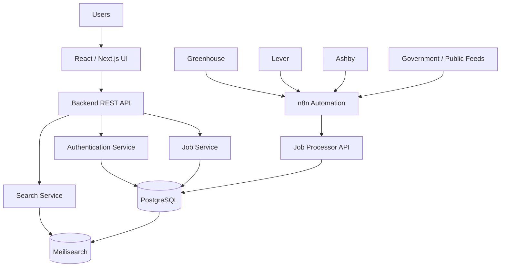
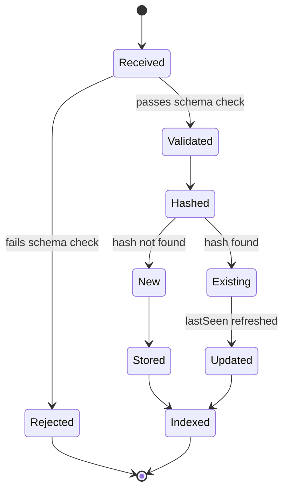
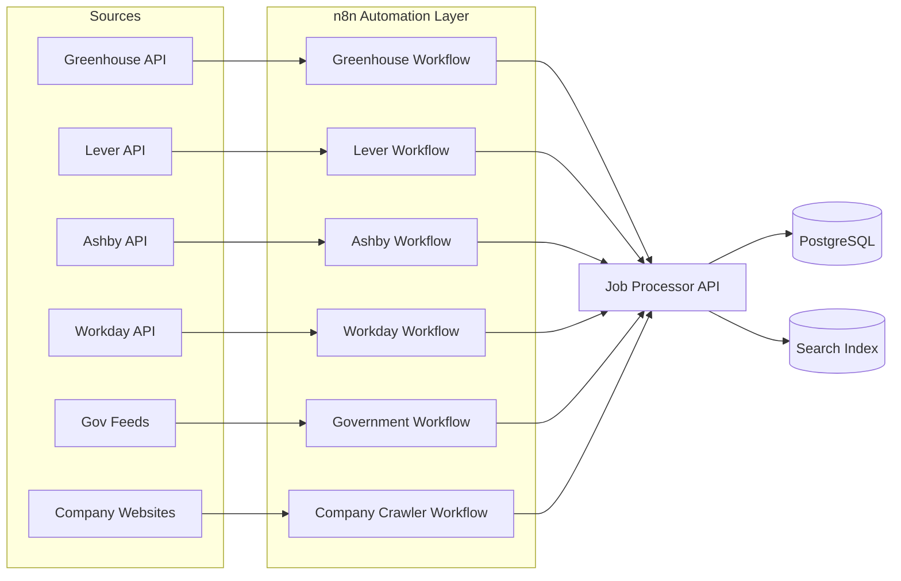
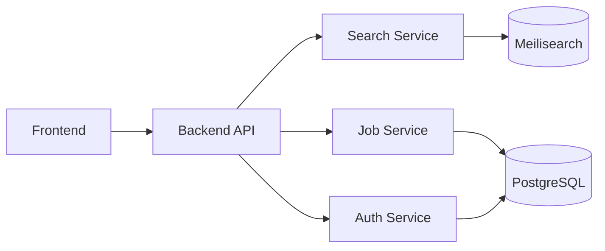
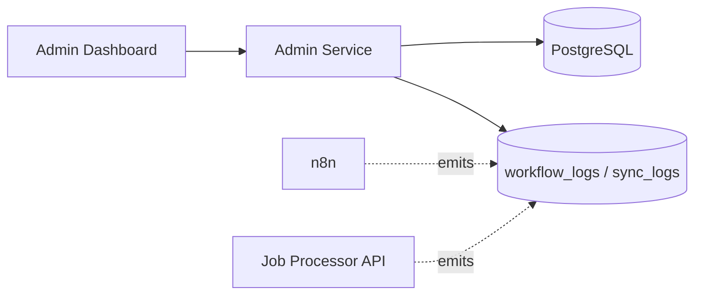
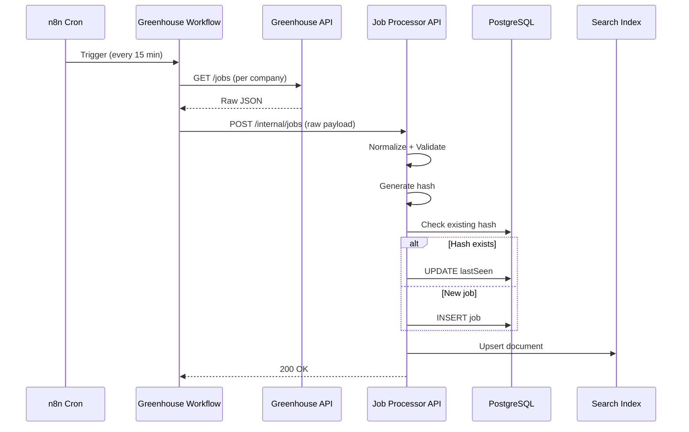
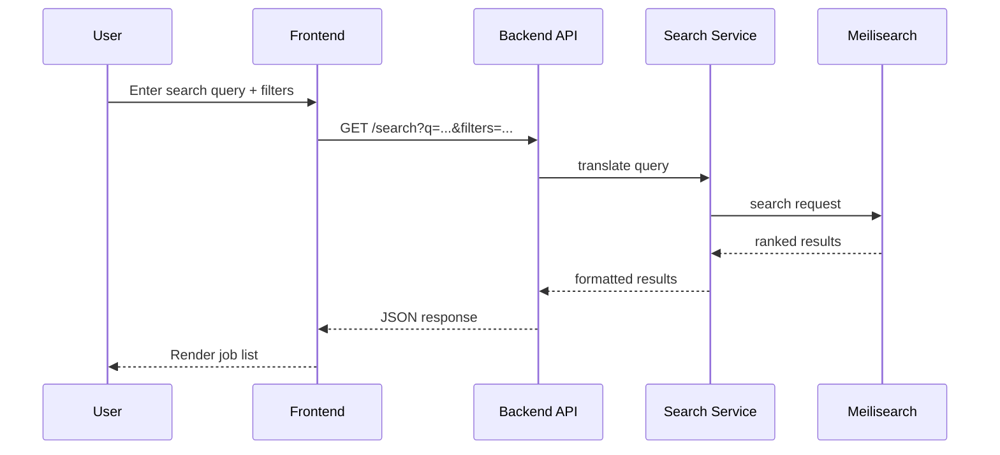
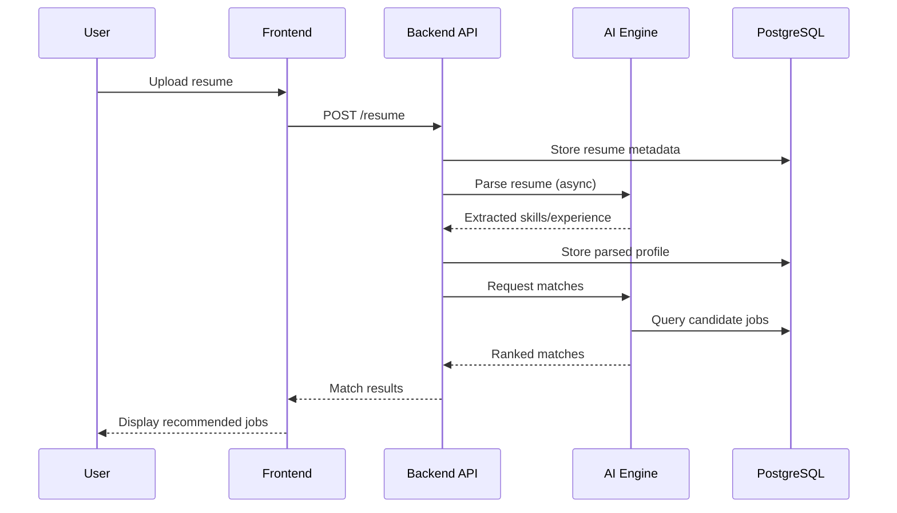
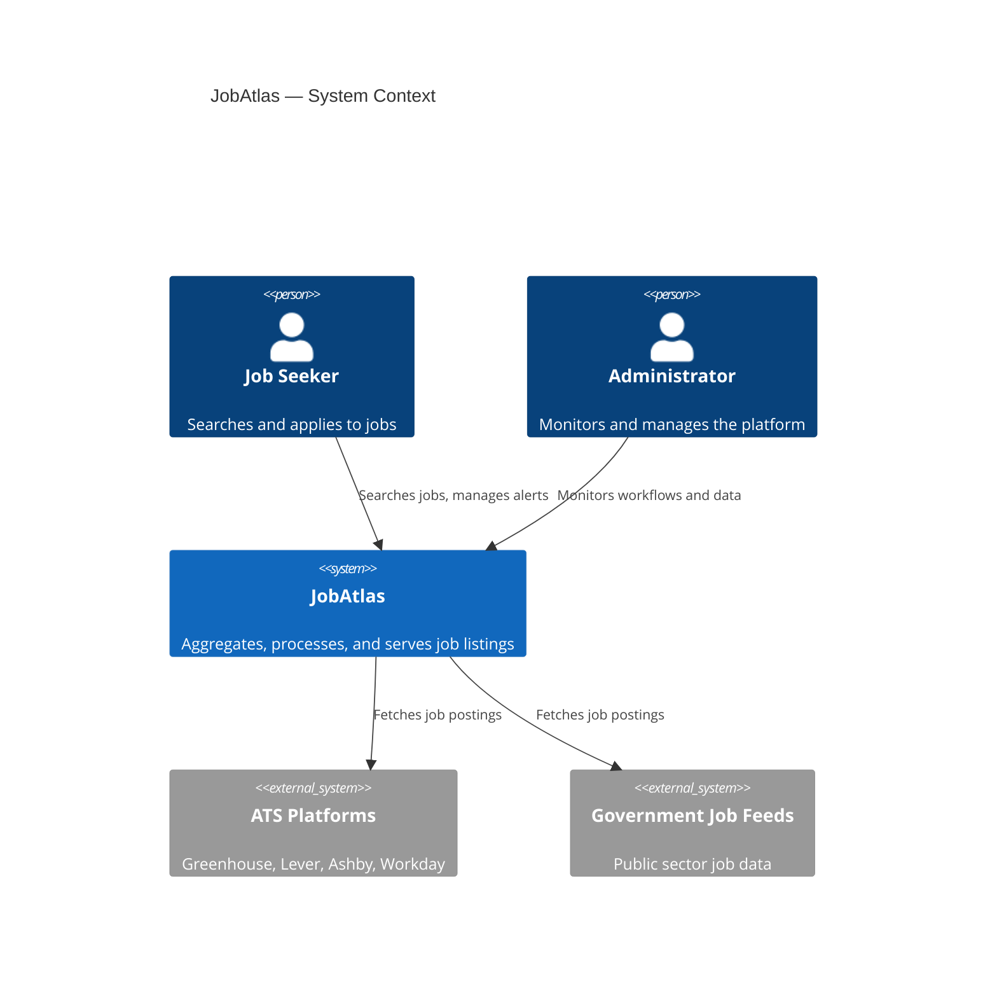
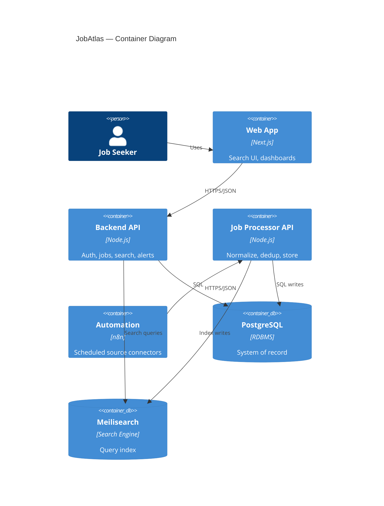

# 📘 BOOK 1 — System Architecture Document (SAD)

| Field | Value |
|---|---|
| Project Name | JobAtlas |
| Document Type | System Architecture Document (SAD) |
| Version | 2.0 (Enterprise Edition) |
| Status | Draft |
| Prepared For | JobAtlas Engineering & AI Coding Agents |
| Audience | Backend engineers, frontend engineers, DevOps, AI agents (Claude Code / Codex), architects |

---

## Table of Contents

**Part I — Foundation**
1. Introduction
2. Vision
3. Business Goals
4. Functional Requirements
5. Non-Functional Requirements
6. User Roles
7. System Overview

**Part II — Architecture**
8. High-Level Architecture
9. Complete Data Flow
10. Job Collection Engine
11. Job Processing Engine
12. Search Engine
13. AI Engine
14. Backend Services
15. Frontend
16. Security
17. Monitoring
18. Scaling Strategy
19. Future Roadmap

**Part III — Enterprise Extensions**
20. Technology Stack Justification
21. Detailed Component Diagrams
22. Sequence Diagrams for Key User Flows
23. C4 Architecture Model
24. Domain-Driven Design
25. Event-Driven Architecture
26. Error Handling Standards
27. Logging Standards
28. Coding Standards
29. API Versioning Strategy
30. Data Governance & Retention
31. Cost Optimization Strategy
32. Legal & Compliance Considerations
33. Disaster Recovery & Business Continuity
34. Risks, Assumptions, and Constraints

---

# PART I — FOUNDATION

## Chapter 1 — Introduction

### 1.1 Project Name
JobAtlas

### 1.2 Project Description
JobAtlas is a Global Job Aggregation and AI Search Platform. Unlike traditional job boards, JobAtlas does not create job listings. It aggregates jobs from publicly accessible employer career systems (ATS platforms such as Greenhouse, Lever, Ashby, Workday) and open government/public job sources, normalizes the data into a unified schema, removes duplicates, indexes it for fast search, and exposes it through APIs and a web application.

The long-term vision is to operate as a reusable **Job Data Platform**, where the same underlying dataset and services power multiple products:

- Job Search (consumer web app)
- AI Resume Matching
- Job Alerts
- Salary Insights
- Company Analytics
- Career Recommendations
- Recruiter Services
- Public Developer API

### 1.3 Purpose of This Document
This document is the authoritative architectural reference for JobAtlas. It defines system boundaries, component responsibilities, data flow, and non-functional targets. It is written to be directly usable by human engineers and AI coding agents (e.g., Claude Code, Codex) as an implementation contract — every subsequent book (Database, API, n8n Workflows, Frontend, AI, Deployment) inherits its definitions from this document. Where this document and a later book conflict, this document takes precedence unless explicitly superseded.

### 1.4 Document Conventions
- **MUST / SHALL** — mandatory requirement
- **SHOULD** — strong recommendation, deviations must be justified in an ADR (Architecture Decision Record)
- **MAY** — optional
- Diagrams are provided in ASCII and Mermaid format for portability between Markdown renderers.

---

## Chapter 2 — Vision

### 2.1 Vision Statement
Build the world's largest free AI-powered global job search platform using publicly accessible job sources, modular automation, and scalable cloud-native architecture.

### 2.2 Long-Term Vision (Four Stages)

| Stage | Name | Capabilities |
|---|---|---|
| 1 | Job Collection Platform | Collect jobs, store jobs, search jobs |
| 2 | AI Job Search | Semantic search, resume matching, AI recommendations |
| 3 | Career Platform | Resume builder, career advisor, interview prep, salary insights |
| 4 | Developer Platform | Public REST API, GraphQL API, webhooks, recruiter dashboard, enterprise integrations |

### 2.3 Guiding Principles
1. **Data first, product second** — the platform is architected around a clean, reusable job dataset; every product feature is a consumer of that dataset, never a special case baked into ingestion.
2. **Isolation of failure** — one broken source connector must never affect another.
3. **Single source of truth for business logic** — normalization, validation, and deduplication rules live in exactly one place (the Job Processor API), never duplicated across workflows.
4. **Design for 10x before you need it, not 100x** — avoid premature distributed-systems complexity, but never paint the architecture into a corner.

---

## Chapter 3 — Business Goals

### 3.1 Primary Goals
1. Aggregate active jobs from free and publicly available sources.
2. Provide a unified, fast search experience across all sources.
3. Support millions of job records without architectural rewrite.
4. Enable AI-powered recommendations and semantic search.
5. Build a scalable backend suitable for future products (Section 2.2, Stages 3–4).

### 3.2 Success Metrics (KPIs)

| Metric | Target |
|---|---|
| Active Jobs | 5–10 Million |
| Daily Updates | 100K+ |
| Search Response Time (p95) | < 300 ms |
| API Availability | 99.9% |
| Duplicate Rate | < 2% |
| Failed Ingestion Jobs | < 1% |
| Time to Detect a Broken Source | < 30 minutes |

### 3.3 Non-Goals (Explicitly Out of Scope for v1)
- JobAtlas does **not** allow employers to post jobs directly (no employer-submission portal in Phase 1–2).
- JobAtlas does **not** scrape sources that prohibit automated collection in their Terms of Service or `robots.txt`.
- JobAtlas is **not** a full ATS/recruiting CRM.

---

## Chapter 4 — Functional Requirements

### 4.1 Job Collection
- FR-1: The system MUST collect jobs from multiple independent sources (ATS APIs, government feeds, company career pages).
- FR-2: The system MUST support scheduled synchronization per source with independently configurable cadence.
- FR-3: The system MUST retry failed synchronizations with exponential backoff.
- FR-4: The system MUST normalize incoming data into the Unified Job Schema (see Book 2).
- FR-5: The system MUST detect and merge duplicate job postings.
- FR-6: The system MUST update `lastSeen` and status on every successful re-fetch and mark jobs `expired` when no longer observed.

### 4.2 Search
- FR-7: Keyword full-text search.
- FR-8: Location-based search (city, country, radius where available).
- FR-9: Remote-only filter.
- FR-10: Salary range filtering.
- FR-11: Company filtering.
- FR-12: Employment type filtering (full-time, contract, internship, etc.).
- FR-13: AI semantic search (natural-language queries, e.g., "remote React jobs in Europe paying above €70k").

### 4.3 User Features
- FR-14: User registration and login (email/password + OAuth).
- FR-15: Save/bookmark jobs.
- FR-16: Create and manage job alerts (email/push notifications on new matches).
- FR-17: Resume upload and parsing.
- FR-18: AI resume-to-job matching and personalized recommendations.

### 4.4 Administration
- FR-19: Workflow monitoring dashboard (success/failure per source).
- FR-20: Job statistics (volume, growth, source breakdown).
- FR-21: Source health monitoring (uptime, error rate, last successful sync).
- FR-22: Failed synchronization inspection and manual retry.
- FR-23: User management (view, suspend, delete).
- FR-24: Platform analytics (search volume, top queries, conversion to apply-click).

---

## Chapter 5 — Non-Functional Requirements

| Requirement | Target / Approach |
|---|---|
| Scalability | Support 10M+ job records without schema redesign |
| Availability | 99.9% uptime for public API and frontend |
| Performance | < 300ms p95 search latency, < 200ms p95 API latency (non-search) |
| Security | JWT-based auth + OAuth2, RBAC, encrypted secrets |
| Maintainability | Modular services, one responsibility per module, documented contracts |
| Observability | Structured logs, metrics, health checks, alerting on all subsystems |
| Disaster Recovery | Automated daily backups, documented RTO/RPO (see Chapter 33) |
| Portability | Fully containerized (Docker); no hard dependency on a single cloud vendor |
| Data Freshness | High-cadence sources (Greenhouse/Lever/Ashby) reflected within 15 minutes |

---

## Chapter 6 — User Roles

### 6.1 Visitor (unauthenticated)
**Can:** search jobs, view companies, browse filters, view job details.
**Cannot:** save jobs, upload resume, create alerts.

### 6.2 Registered User
**Can:** everything a Visitor can, plus: save jobs, click-through apply, upload resume, receive AI recommendations, create/manage job alerts, manage account settings.

### 6.3 Administrator
**Can:** monitor workflows, manage users, view all logs, manually trigger synchronization, view analytics, manage source configuration, moderate flagged content.

### 6.4 System (automated role)
Non-human actor used for internal service-to-service calls. Responsible for: synchronization jobs, cleanup jobs, notification dispatch, AI indexing, scheduled maintenance. Authenticated via service credentials, never user credentials.

### 6.5 Role Permission Matrix

| Action | Visitor | User | Admin | System |
|---|:---:|:---:|:---:|:---:|
| Search jobs | ✅ | ✅ | ✅ | ✅ |
| View job/company detail | ✅ | ✅ | ✅ | ✅ |
| Save/bookmark job | ❌ | ✅ | ✅ | ❌ |
| Create job alert | ❌ | ✅ | ✅ | ❌ |
| Upload resume | ❌ | ✅ | ✅ | ❌ |
| Trigger sync manually | ❌ | ❌ | ✅ | ✅ |
| View workflow logs | ❌ | ❌ | ✅ | ✅ |
| Manage users | ❌ | ❌ | ✅ | ❌ |
| Write to database | ❌ | ❌ | ❌ | ✅ (via Job Processor API only) |

---

## Chapter 7 — System Overview

JobAtlas is composed of six major layers, each communicating through well-defined APIs or async events, allowing components to evolve and scale independently.

```
Presentation Layer   (React / Next.js)
        │
API Layer            (REST, versioned)
        │
Business Layer        (Auth, Job, Search, Alert, User, Admin services)
        │
Data Layer            (PostgreSQL)
        │
Search Layer          (Meilisearch / OpenSearch)
        │
Automation Layer      (n8n — Collection & Processing workflows)
```

### 7.1 Layer Responsibilities

| Layer | Responsibility | Owns |
|---|---|---|
| Presentation | Renders UI, calls Backend API only | No business logic, no DB access |
| API | Auth, routing, validation, rate limiting | Request/response contracts |
| Business | Core domain logic | Services (Chapter 14) |
| Data | Persistent storage | PostgreSQL schema (Book 2) |
| Search | Fast query/filter | Search indexes, derived from Data Layer |
| Automation | Scheduled collection & processing | n8n workflows (Book 4) |

---

# PART II — ARCHITECTURE

## Chapter 8 — High-Level Architecture

```
                          Users
                            │
                            ▼
                 React / Next.js UI
                            │
                            ▼
                   Backend REST API
                            │
      ┌─────────────────────┼─────────────────────┐
      ▼                     ▼                     ▼
 Authentication         Job Service         Search Service
      │                     │                     │
      └──────────────┬──────┴─────────────────────┘
                      ▼
               PostgreSQL Database
                      │
           ┌──────────┴──────────┐
           ▼                     ▼
      Meilisearch           n8n Automation
                                  │
             ┌────────────────────┼───────────────────┐
             ▼                    ▼                    ▼
        Greenhouse             Lever            Public ATS / Gov Feeds
```

### 8.1 Mermaid Version



### 8.2 Component Inventory

| Component | Technology (recommended) | Purpose |
|---|---|---|
| Frontend | Next.js (React) | User-facing web application |
| Backend API | Node.js (NestJS or Express) or equivalent | REST API, business logic |
| Job Processor API | Node.js service | Central validation/normalization/dedup |
| Automation | n8n | Scheduled source connectors |
| Database | PostgreSQL 15+ | System of record |
| Search | Meilisearch (v1) → OpenSearch (v2) | Fast filtered search |
| Cache/Queue | Redis | Caching, rate limiting, future queueing |
| Reverse Proxy | Traefik | TLS termination, routing |
| Orchestration | Docker Compose → Coolify | Deployment management |

---

## Chapter 9 — Complete Data Flow

```
Job Source
    │
    ▼
n8n Fetch Workflow  ──(raw JSON/HTML)──▶  Job Processor API
                                                │
                                     ┌──────────┼──────────┐
                                     ▼          ▼          ▼
                                Normalize   Validate   Hash + Dedup
                                     │          │          │
                                     └──────────┴──────────┘
                                                ▼
                                          PostgreSQL
                                                │
                                                ▼
                                          Search Index
                                                │
                                                ▼
                                         Backend API
                                                │
                                                ▼
                                          Frontend / API consumers
```

Every job, regardless of source, MUST follow this exact pipeline. Source workflows are strictly forbidden from writing to PostgreSQL or the search index directly (see Chapter 25 — Event-Driven Architecture, and the Job Processor API rationale below).

### 9.1 Why a Central Job Processor API
If every n8n workflow wrote directly to PostgreSQL:
- Validation/dedup logic would be duplicated across 10+ workflows.
- A new source would require re-implementing business rules.
- Migrating away from n8n would require rewriting every workflow's persistence logic.

Centralizing this logic behind one internal API means: **workflows fetch, the API decides what happens to the data.**

---

## Chapter 10 — Job Collection Engine

### 10.1 Responsibility
Connect to job sources, fetch raw job data, handle retries/rate limits, and forward raw payloads to the Job Processing Engine. It MUST NEVER transform, validate, or store data — that is a processing-layer responsibility.

### 10.2 Design Rules
- One workflow per source. Never combine sources in a single workflow.
- If one source's workflow fails, all others continue unaffected (isolation by design).
- Each connector outputs the same "envelope" format regardless of source-specific payload shape:

```json
{
  "source": "greenhouse",
  "fetchedAt": "2026-08-02T10:00:00Z",
  "raw": { }
}
```

### 10.3 Supported Source Types (v1)
1. Greenhouse (ATS API)
2. Lever (ATS API)
3. Ashby (ATS API)
4. Workday (ATS API, heavier/slower cadence)
5. Government job feeds (jurisdiction-specific)
6. Company career pages (JobPosting schema.org extraction)

Full connector-level detail is specified in Book 4 (n8n Workflow Documentation).

---

## Chapter 11 — Job Processing Engine

### 11.1 Responsibility
1. Normalize source-specific fields into the Unified Job Schema (Book 2).
2. Validate required fields (reject/quarantine incomplete records).
3. Generate a deterministic job fingerprint (SHA-256 of company + title + location + applyUrl).
4. Detect duplicates against existing records.
5. Insert new records or update `lastSeen` on existing matches.
6. Flag jobs as `expired` when no longer observed across N consecutive sync cycles.

### 11.2 Processing State Machine



---

## Chapter 12 — Search Engine

### 12.1 Responsibilities
- Full-text search across title, description, company.
- Faceted filtering: location, remote, salary range, employment type, company.
- AI semantic search (Stage 2, Chapter 13).

### 12.2 Technology Decision
**v1: Meilisearch** — chosen for operational simplicity, low resource footprint, typo tolerance out of the box, and fast time-to-value for a solo/small team.
**v2 candidate: OpenSearch** — adopted only once index size or query complexity (e.g., vector search at scale, complex aggregations) exceeds what Meilisearch comfortably handles. This is a deliberate deferred decision, not an oversight — see Chapter 20.

### 12.3 Index Update Strategy
The search index is a **derived, rebuildable artifact**, never a system of record. PostgreSQL is always the source of truth; the index is updated synchronously by the Job Processor API on write, with a nightly full-reconciliation job as a safety net (Book 4, Maintenance workflows).

---

## Chapter 13 — AI Engine

### 13.1 v1 Capabilities
- Resume parsing (extract skills, experience, titles from uploaded resumes).
- Resume-to-job matching (structured similarity, not yet embeddings-based).
- Job description summarization.
- Skill extraction from job descriptions.

### 13.2 Future Capabilities (Stage 2+)
- Semantic search via embeddings.
- Personalized recommendation feed.
- Company insight generation.
- Interview preparation content.

Full specification is deferred to Book 6 (AI Documentation) to avoid premature coupling of architecture to a specific model/vendor.

---

## Chapter 14 — Backend Services

The backend is organized as modular services with clear API contracts and minimal coupling. In v1 these MAY be deployed as a single application with internal module boundaries (modular monolith); the contracts below are designed so each can be extracted into an independent service later without breaking consumers.

| Service | Responsibility |
|---|---|
| Authentication Service | Registration, login, JWT issuance, OAuth |
| Job Service | Job CRUD (internal), job detail retrieval |
| Job Processor API | Ingestion pipeline entry point (Chapter 9, 11) |
| Company Service | Company profile aggregation |
| Search Service | Query translation to search index |
| Alert Service | Alert creation, matching, dispatch trigger |
| User Service | Profile, saved jobs, resume management |
| Admin Service | Monitoring, analytics, moderation |

---

## Chapter 15 — Frontend

### 15.1 Pages (v1)
Homepage · Search · Job Detail · Company Profile · Saved Jobs · Job Alerts · Resume Upload · User Dashboard · Admin Dashboard

### 15.2 Architectural Rule
The frontend MUST remain stateless with respect to business logic — all business rules (deduplication, matching, eligibility, permissions) live server-side. The frontend is a rendering and interaction layer only. Full specification is in Book 5.

---

## Chapter 16 — Security

Core principles:
1. JWT-based authentication with short-lived access tokens + refresh tokens.
2. Role-Based Access Control (RBAC) enforced at the API layer (not just UI hiding).
3. HTTPS-only for all traffic (enforced at the reverse proxy).
4. Input validation and sanitization on every API boundary.
5. Rate limiting on all public endpoints, stricter limits on unauthenticated traffic.
6. Secrets managed via environment injection / secret manager, never committed to source control.
7. Audit logging for all administrative actions (who, what, when).

---

## Chapter 17 — Monitoring

Every subsystem MUST emit structured logs and health metrics. Minimum monitored signals:

- Workflow success/failure rate (per source)
- API response times (p50/p95/p99)
- Database performance (query latency, connection pool saturation)
- Search indexing lag and health
- Queue depth (once introduced in Phase 3)
- Error rates by service and endpoint

Full alerting thresholds and dashboards are specified in Book 7 (Deployment & Scaling).

---

## Chapter 18 — Scaling Strategy

| Phase | Infrastructure |
|---|---|
| Phase 1 | Single n8n instance, single PostgreSQL instance, single Meilisearch instance |
| Phase 2 | Multiple ingestion workers, dedicated processing service, PostgreSQL read replicas, search cluster |
| Phase 3 | Distributed crawlers, message queues (e.g., Redis Streams or a broker), microservice extraction, multi-region deployment |

Scaling triggers (when to move phases) are quantified in Chapter 18's companion in Book 7, tied to the KPIs in Chapter 3.

---

## Chapter 19 — Future Roadmap

The architecture anticipates the following without requiring a fundamental redesign:
Mobile applications · Public API platform · Recruiter portal · Employer self-service dashboards · AI career coaching · Salary analytics · Global localization · Plugin ecosystem.

---

# PART III — ENTERPRISE EXTENSIONS

## Chapter 20 — Technology Stack Justification

| Layer | Choice | Why | Alternatives Considered |
|---|---|---|---|
| Database | PostgreSQL | Mature, relational integrity for jobs/companies/users, strong JSON support (`jsonb`) for source-specific extras, excellent tooling | MySQL (weaker JSON/indexing flexibility), MongoDB (rejected — job data is highly relational: companies, sources, users, alerts) |
| Search | Meilisearch → OpenSearch | Fast to operate, low ops burden for v1; OpenSearch reserved for when scale/vector search demands it | Elasticsearch (licensing complexity), Algolia (cost at 10M+ docs), Typesense (similar to Meilisearch, smaller ecosystem) |
| Automation | n8n | Visual workflow orchestration ideal for many independent, similar-shaped connectors; self-hostable; avoids writing bespoke cron/queue infra for v1 | Airflow (heavier, code-first, overkill for connector-style jobs at this stage), custom Node cron scripts (harder to monitor/maintain visually) |
| Backend | Node.js | Same language as n8n custom nodes and frontend; large ecosystem; async I/O well suited to API aggregation workloads | Python/FastAPI (strong AI ecosystem — reconsidered specifically for the AI Engine, see Book 6), Go (higher perf, smaller team velocity at this stage) |
| Frontend | Next.js (React) | SSR/ISR for SEO on job pages (critical for organic traffic acquisition), large hiring pool, mature ecosystem | Remix, SvelteKit (smaller ecosystem, less critical mass for this team's velocity target) |
| Cache | Redis | De facto standard, doubles as rate-limiter store and future queue backend | Memcached (no data structures, no pub/sub for future event needs) |
| Reverse Proxy | Traefik | Native Docker/Coolify integration, automatic TLS via Let's Encrypt | Nginx (more manual config), Caddy (comparable, Traefik chosen for label-based Docker discovery) |
| Deployment | Docker Compose → Coolify | Self-hosted, cost-predictable, avoids vendor lock-in during pre-revenue phase | Kubernetes (deferred — unnecessary operational overhead until Phase 3 scale) |

**Principle:** every "heavier" alternative (OpenSearch, Kubernetes, microservices, message queues) is deliberately deferred, not rejected. Chapter 18 and Book 7 define the measurable triggers for adopting them.

---

## Chapter 21 — Detailed Component Diagrams

### 21.1 Job Ingestion Subsystem



### 21.2 Query Subsystem



### 21.3 Admin & Monitoring Subsystem



---

## Chapter 22 — Sequence Diagrams for Key User Flows

### 22.1 Job Ingestion (Greenhouse example)



### 22.2 User Search Flow



### 22.3 Resume Upload & Matching



---

## Chapter 23 — C4 Architecture Model

### 23.1 Level 1 — System Context



### 23.2 Level 2 — Containers



### 23.3 Level 3 — Components (Backend API)
Authentication Component · Job Component · Search Component · Alert Component · User Component · Admin Component — each mapped 1:1 to the services in Chapter 14, each with its own controller/service/repository layering (Book 3 defines exact endpoint contracts).

### 23.4 Level 4 — Code
Deferred to each book's implementation notes and to inline code documentation; the SAD intentionally stops at Component level to remain stable as implementation details change.

---

## Chapter 24 — Domain-Driven Design

### 24.1 Bounded Contexts

| Bounded Context | Core Entities | Owns |
|---|---|---|
| Ingestion | RawJobPayload, SourceConnector | Fetching, envelope format |
| Job Catalog | Job, Company, Source | Canonical job data |
| Search | SearchQuery, SearchResult | Query translation, ranking |
| Identity | User, Session, Role | AuthN/AuthZ |
| Engagement | SavedJob, JobAlert, Notification | User interaction with jobs |
| AI | ResumeProfile, MatchScore, Embedding | AI-derived data |
| Administration | WorkflowLog, SyncLog, AuditLog | Operational visibility |

### 24.2 Ubiquitous Language (excerpt)

| Term | Definition |
|---|---|
| Job | A single normalized job posting in the Unified Job Schema |
| Source | An origin system a job was collected from (e.g., Greenhouse) |
| Connector | The n8n workflow responsible for fetching from one Source |
| Fingerprint | The SHA-256 hash used to detect duplicate Jobs |
| Stale | A Job not observed in the last N sync cycles, pending expiry |
| Match | An AI-computed relevance score between a ResumeProfile and a Job |

### 24.3 Context Mapping
Ingestion → Job Catalog is a **Customer/Supplier** relationship: Ingestion supplies raw payloads, Job Catalog (via the Job Processor API) is the authority on what becomes a canonical Job. Search is a **read-model** derived from Job Catalog (Conformist to Job Catalog's schema). AI is a **downstream consumer** of both Job Catalog and Identity, never a source of truth for either.

---

## Chapter 25 — Event-Driven Architecture

### 25.1 v1 Approach: Synchronous with Event Logging
In Phase 1–2, ingestion is synchronous (n8n → Job Processor API, HTTP request/response) to keep operational complexity low. However, every state transition (Chapter 11.2) MUST be logged as a discrete event record in `job_updates` / `sync_logs`, so the system is **event-sourced in its logging even while not event-driven in its transport**. This makes the future migration additive, not a rewrite.

### 25.2 Phase 3 Target: Async Event Bus
When ingestion volume requires decoupling (Chapter 18, Phase 3), introduce an event bus (Redis Streams or equivalent) with events such as:

- `job.received`
- `job.validated`
- `job.rejected`
- `job.deduplicated`
- `job.stored`
- `job.indexed`
- `job.expired`

Consumers (search indexer, notification dispatcher, analytics) subscribe independently, removing the Job Processor API from the critical path of every downstream concern.

### 25.3 Event Schema (forward-looking)
```json
{
  "eventType": "job.stored",
  "jobId": "uuid",
  "source": "greenhouse",
  "timestamp": "ISO-8601",
  "metadata": { }
}
```

---

## Chapter 26 — Error Handling Standards

### 26.1 Principles
1. Fail loudly in logs, fail gracefully to the caller.
2. Never let a single malformed record halt a batch — quarantine and continue.
3. Every error MUST be classified (see 26.2) so dashboards can distinguish "expected/handled" from "unexpected/needs attention."

### 26.2 Error Classification

| Class | Example | Handling |
|---|---|---|
| Transient | Source API timeout | Retry with exponential backoff (max 5 attempts) |
| Validation | Missing required field | Quarantine record, log, continue batch |
| Duplicate | Hash collision (expected) | Not an error — normal update path |
| Auth | Expired token to internal API | Refresh and retry once, else alert |
| Fatal | Source schema changed entirely | Halt that connector, page admin, others unaffected |

### 26.3 API Error Response Contract (all services)
```json
{
  "error": {
    "code": "VALIDATION_ERROR",
    "message": "Field 'title' is required",
    "requestId": "uuid",
    "timestamp": "ISO-8601"
  }
}
```
Full per-endpoint error catalogs are defined in Book 3 (API Documentation).

---

## Chapter 27 — Logging Standards

### 27.1 Format
Structured JSON logs, one line per event, minimum fields:
```json
{
  "timestamp": "ISO-8601",
  "level": "info|warn|error",
  "service": "job-processor-api",
  "requestId": "uuid",
  "message": "human readable",
  "context": { }
}
```

### 27.2 Log Levels

| Level | Usage |
|---|---|
| debug | Local development only, never in production by default |
| info | Normal operational events (job stored, sync completed) |
| warn | Recoverable anomalies (retry triggered, quarantined record) |
| error | Failed operations requiring attention |
| fatal | Service cannot continue (triggers paging) |

### 27.3 Retention
Application logs: 30 days hot, 90 days cold archive. Audit logs (admin actions): retained 1 year minimum (see Chapter 30, Data Governance).

---

## Chapter 28 — Coding Standards

### 28.1 General
- One responsibility per module/file (mirrors the "single responsibility" principle applied throughout this document).
- No business logic in controllers/route handlers — controllers call services, services contain logic.
- No source-specific logic outside the Ingestion bounded context (Chapter 24).
- All public functions/exports documented with purpose, params, return type.

### 28.2 Naming Conventions

| Entity | Convention | Example |
|---|---|---|
| Database tables | `snake_case`, plural | `jobs`, `workflow_logs` |
| Database columns | `snake_case` | `applied_at`, `posted_at` |
| API JSON fields | `camelCase` | `applyUrl`, `postedAt` |
| REST endpoints | kebab-case, plural nouns | `/api/v1/job-alerts` |
| n8n workflows | `Source / Purpose` | `Greenhouse / Fetch Jobs` |
| Environment variables | `SCREAMING_SNAKE_CASE` | `DATABASE_URL` |

### 28.3 Git & Review
- Trunk-based development with short-lived feature branches.
- Every PR touching ingestion logic MUST include a sample raw payload + expected normalized output in the PR description.
- No direct commits to `main`.

---

## Chapter 29 — API Versioning Strategy

- All public and internal APIs are versioned in the URL path: `/api/v1/...`.
- Breaking changes require a new version (`/api/v2/...`); non-breaking additive changes (new optional fields, new endpoints) do not.
- Minimum deprecation window for a public API version: 6 months, with a `Deprecation` and `Sunset` HTTP header on affected responses.
- Internal-only endpoints (e.g., the Job Processor API's ingestion endpoint) are exempt from the public deprecation window but MUST still be versioned to allow independent evolution from the public API.
- Full endpoint-by-endpoint contracts live in Book 3.

---

## Chapter 30 — Data Governance & Retention

| Data Category | Retention | Notes |
|---|---|---|
| Active jobs | Indefinite while active | Status transitions to `expired`, never hard-deleted immediately |
| Expired jobs | 12 months, then archived/deleted | Preserves historical analytics window |
| User accounts | Until deletion requested | Right-to-erasure supported (Chapter 32) |
| Resumes | Until user deletes or account deleted | Stored encrypted at rest |
| Workflow/sync logs | 90 days hot | Aggregated metrics retained longer |
| Audit logs (admin actions) | 1 year minimum | Compliance requirement |

### 30.1 Data Minimization
The system collects only publicly available job posting data plus data the user explicitly provides (resume, saved jobs, alert criteria). No collection of data beyond what's needed for the stated features.

---

## Chapter 31 — Cost Optimization Strategy

1. **Self-hosted core infra** (Docker Compose / Coolify) rather than managed equivalents during pre-revenue phase, to keep infrastructure cost predictable and low.
2. **Meilisearch before OpenSearch** — smaller memory footprint, deferred cost of a heavier cluster until scale actually demands it (Chapter 20).
3. **Scheduled cadence tuned per source value** — high-signal sources (Greenhouse/Lever/Ashby) poll every 15 minutes; low-churn sources (company websites) poll every 6–24 hours, reducing unnecessary compute and avoiding aggressive-crawling risk.
4. **Cold storage for expired jobs** — move data out of the hot database/index once it stops serving live traffic.
5. **CDN for static frontend assets** — reduces origin load and improves global latency without significant cost (Book 7).

---

## Chapter 32 — Legal & Compliance Considerations

> **Note:** This section provides an engineering-relevant summary, not legal advice. A qualified professional should review data-collection practices before public launch.

1. **Source compliance** — connectors MUST respect each source's Terms of Service and `robots.txt`. Sources that explicitly prohibit automated collection MUST NOT be added as connectors regardless of technical feasibility (Chapter 3.3, Non-Goals).
2. **Attribution** — where a source's terms require attribution or an apply-through link (rather than direct application), the `applyUrl` field MUST point to the original source, never a scraped/cloned application flow.
3. **Personal data (users)** — subject to standard data-protection principles: lawful basis for processing, right to access, right to erasure, data portability. Applies primarily to Identity and Engagement bounded contexts (Chapter 24), not to aggregated public job data.
4. **Resume data** is the most sensitive data category in the system and MUST be encrypted at rest and access-logged.
5. **Regional applicability** — if operating in or targeting users in the EU/UK, GDPR principles apply; if targeting California users, CCPA/CPRA principles apply. Regional legal review is a prerequisite for public launch, not an engineering task this document can complete.

---

## Chapter 33 — Disaster Recovery & Business Continuity

| Parameter | Target |
|---|---|
| RPO (Recovery Point Objective) | ≤ 24 hours (daily automated backup) |
| RTO (Recovery Time Objective) | ≤ 4 hours for core services (API, DB, search) |
| Backup frequency | Daily full PostgreSQL backup + continuous WAL archiving |
| Backup verification | Automated restore test monthly |
| Search index recovery | Rebuildable from PostgreSQL at any time — index is never the sole copy of data (Chapter 12.3) |

### 33.1 Failure Scenarios & Response

| Scenario | Response |
|---|---|
| Single source connector fails | Isolated by design (Chapter 10); alert admin, other sources unaffected |
| Job Processor API down | n8n workflows retry with backoff; no data loss, delayed ingestion only |
| PostgreSQL primary failure | Restore from latest backup + WAL replay; promote standby if replication configured (Phase 2+) |
| Search index corrupted | Full reindex from PostgreSQL (source of truth) |
| Full infrastructure loss | Restore from off-site backup copies; documented runbook in Book 7 |

---

## Chapter 34 — Risks, Assumptions, and Constraints

### 34.1 Risks

| Risk | Impact | Mitigation |
|---|---|---|
| Source changes API/schema without notice | Broken ingestion for that source | Isolation per connector (Ch. 10), schema validation alerts (Ch. 26) |
| Source blocks automated access | Data gap | Diversify sources, respect rate limits, maintain fallback sources per category |
| Duplicate detection false positives/negatives | Data quality issues | Deterministic hash strategy (Ch. 11), periodic manual QA sampling |
| Search engine outgrows Meilisearch capacity | Degraded search performance | Pre-defined migration path to OpenSearch (Ch. 12, 20) |
| Resume data breach | Severe reputational/legal impact | Encryption at rest, access logging, minimal retention (Ch. 30, 32) |
| Single point of failure in Job Processor API (v1) | Ingestion pipeline stall | Retry-tolerant design at connector level; horizontal scaling path defined (Ch. 18 Phase 2) |

### 34.2 Assumptions
- Target sources' public APIs/pages remain accessible without authentication for the majority of connectors.
- Initial team size is small (1–3 engineers); architecture favors operational simplicity over premature distributed-systems sophistication.
- Self-hosted infrastructure (Coolify/Docker) is acceptable for the pre-revenue phase.

### 34.3 Constraints
- No employer-direct job posting in v1 (Chapter 3.3).
- Must remain legally compliant with each source's terms (Chapter 32) — technical feasibility never overrides this constraint.
- Budget-conscious infrastructure choices during pre-revenue phase (Chapter 31).

---

## Document Status & Next Steps

This completes **Book 1 — System Architecture Document, v2.0 (Enterprise Edition)**. It is the foundation all subsequent books build on:

- **Book 2 — Database Design Document** will implement the Unified Job Schema (Ch. 9), entity list (Ch. 24), and retention rules (Ch. 30) as concrete PostgreSQL DDL.
- **Book 3 — API Specification** will implement every service in Chapter 14 as versioned (Ch. 29), error-standardized (Ch. 26) REST endpoints.
- **Book 4 — n8n Workflow Documentation** will implement every connector in Chapter 10/21.1 in full workflow-level detail.
- **Book 5 — Frontend Documentation** will implement the pages in Chapter 15.
- **Book 6 — AI Documentation** will implement the AI Engine in Chapter 13.
- **Book 7 — Deployment & Scaling** will implement the infrastructure in Chapter 20, 31, and 33.

**Status: ✅ Book 1 Complete — Ready to proceed to Book 2 (Database Design Document).**
