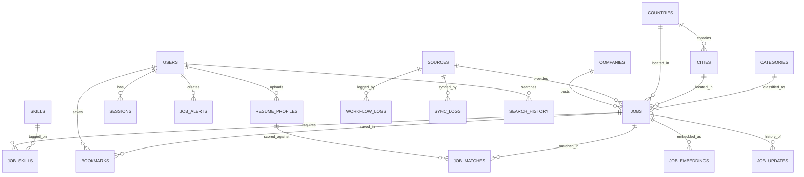

# 📗 BOOK 2 — Database Design Document (DDD)

| Field | Value |
|---|---|
| Project Name | JobAtlas |
| Document Type | Database Design Document |
| Version | 1.0 |
| Status | Draft |
| Database Engine | PostgreSQL 15+ |
| Depends On | Book 1 — System Architecture Document (Ch. 9, 11, 24, 30) |

---

## Table of Contents

1. Introduction & Design Principles
2. Entity Relationship Diagram
3. Naming & Type Conventions
4. Core Schema — Jobs Domain
5. Core Schema — Companies & Sources Domain
6. Reference Data — Countries, Cities, Skills, Categories
7. Identity Domain — Users & Sessions
8. Engagement Domain — Bookmarks & Job Alerts
9. AI Domain — Embeddings & Resume Profiles
10. Operational Domain — Logs (Workflow, Sync, API, Job Updates)
11. Search History
12. Full DDL Reference (Consolidated)
13. Indexing Strategy
14. Partitioning Strategy
15. Performance Optimization
16. Data Integrity & Constraints Summary
17. Backup & Recovery Strategy
18. Migration Strategy
19. Sample Queries
20. Checklists & Acceptance Criteria

---

## Chapter 1 — Introduction & Design Principles

### 1.1 Purpose
This document defines the complete PostgreSQL schema for JobAtlas: every table, column, type, constraint, index, and relationship. It is the direct implementation of the Unified Job Schema (Book 1, Ch. 9), the bounded-context entity list (Book 1, Ch. 24), and the data retention rules (Book 1, Ch. 30). It is written to be handed directly to an engineer or AI coding agent to generate migrations.

### 1.2 Design Principles
1. **PostgreSQL is the single source of truth.** The search index (Meilisearch/OpenSearch) is always rebuildable from this database — never the reverse.
2. **Normalize the relational core, denormalize for read performance where justified.** Companies, sources, and reference data are normalized; the `jobs` table itself is intentionally wide to avoid excessive joins on the hottest read path.
3. **Every table that can grow unbounded has an explicit retention/partitioning plan** (Book 1, Ch. 30 and Ch. 14 of this document).
4. **UUIDs for all primary keys** exposed via API (jobs, companies, users, alerts) to avoid leaking sequential IDs and to support future multi-writer/distributed scenarios (Book 1, Ch. 18 Phase 3). Purely internal/log tables MAY use `BIGSERIAL` for cheaper storage and faster inserts.
5. **Soft state transitions, not hard deletes**, for jobs (`status` field) — aligns with Book 1 Ch. 30 retention rules.
6. **Every write-heavy table carries `created_at`/`updated_at`** for auditability and debugging.

---

## Chapter 2 — Entity Relationship Diagram



### 2.1 Relationship Summary

| Parent | Child | Relationship | Notes |
|---|---|---|---|
| companies | jobs | 1:N | A company has many jobs |
| sources | jobs | 1:N | A source provides many jobs |
| countries | cities | 1:N | Reference hierarchy |
| jobs | job_skills | 1:N (join table) | Many-to-many jobs↔skills |
| users | bookmarks | 1:N | A user bookmarks many jobs |
| users | job_alerts | 1:N | A user creates many alerts |
| users | resume_profiles | 1:N | Versioned resume uploads |
| resume_profiles | job_matches | 1:N | AI match scores |
| jobs | job_updates | 1:N | Full change history per job |
| sources | workflow_logs / sync_logs | 1:N | Operational logging |

---

## Chapter 3 — Naming & Type Conventions

(Consistent with Book 1, Chapter 28.2)

| Rule | Convention |
|---|---|
| Table names | `snake_case`, plural (`jobs`, `job_alerts`) |
| Column names | `snake_case` (`posted_at`, `apply_url`) |
| Primary keys | `id`, type `UUID DEFAULT gen_random_uuid()` for domain tables; `BIGSERIAL` for log tables |
| Foreign keys | `<singular_table>_id` (`company_id`, `source_id`) |
| Timestamps | `TIMESTAMPTZ`, always UTC |
| Booleans | prefixed `is_`/`has_` where ambiguous (`is_remote`, `has_salary`) |
| Enums | PostgreSQL `ENUM` types where the value set is small and stable; `TEXT` + `CHECK` where it may evolve frequently |
| Money | `NUMERIC(12,2)` never `FLOAT` |

---

## Chapter 4 — Core Schema: Jobs Domain

### 4.1 `jobs` (the central table)

This table is the concrete implementation of the Unified Job Schema defined in Book 1, Chapter 9.

```sql
CREATE TYPE job_status AS ENUM ('active', 'expired', 'flagged', 'removed');
CREATE TYPE employment_type AS ENUM (
    'full_time', 'part_time', 'contract', 'internship', 'temporary', 'unknown'
);

CREATE TABLE jobs (
    id                  UUID PRIMARY KEY DEFAULT gen_random_uuid(),

    -- Source lineage
    source_id           UUID NOT NULL REFERENCES sources(id),
    external_id         TEXT NOT NULL,           -- ID in the source system
    fingerprint_hash    CHAR(64) NOT NULL,        -- SHA-256, see Book 1 Ch.11

    -- Core content
    company_id          UUID NOT NULL REFERENCES companies(id),
    title               TEXT NOT NULL,
    description         TEXT NOT NULL,
    description_html    TEXT,                     -- optional raw HTML variant

    -- Location
    country_id          UUID REFERENCES countries(id),
    city_id             UUID REFERENCES cities(id),
    location_raw         TEXT,                     -- unparsed original string
    is_remote           BOOLEAN NOT NULL DEFAULT FALSE,

    -- Employment details
    employment_type     employment_type NOT NULL DEFAULT 'unknown',
    category_id         UUID REFERENCES categories(id),

    -- Compensation
    salary_min           NUMERIC(12,2),
    salary_max           NUMERIC(12,2),
    currency             CHAR(3),                   -- ISO 4217

    -- Lifecycle
    status               job_status NOT NULL DEFAULT 'active',
    posted_at            TIMESTAMPTZ,
    first_seen_at        TIMESTAMPTZ NOT NULL DEFAULT now(),
    last_seen_at         TIMESTAMPTZ NOT NULL DEFAULT now(),
    expired_at           TIMESTAMPTZ,

    -- Application
    apply_url            TEXT NOT NULL,

    -- Housekeeping
    created_at           TIMESTAMPTZ NOT NULL DEFAULT now(),
    updated_at           TIMESTAMPTZ NOT NULL DEFAULT now(),

    CONSTRAINT uq_jobs_source_external UNIQUE (source_id, external_id),
    CONSTRAINT uq_jobs_fingerprint UNIQUE (fingerprint_hash),
    CONSTRAINT chk_salary_range CHECK (
        salary_min IS NULL OR salary_max IS NULL OR salary_min <= salary_max
    )
);
```

**Design notes:**
- `fingerprint_hash` implements the deduplication strategy from Book 1 Ch. 11 (`SHA-256(company + title + location + apply_url)`), enforced UNIQUE at the database level as a second line of defense beyond application-layer checks.
- `uq_jobs_source_external` prevents the same source from ever creating two rows for the same external job ID, independent of the fingerprint.
- `status = 'flagged'` supports moderation workflows (e.g., suspected spam/expired-but-still-listed) without deleting data.

### 4.2 `job_skills` (many-to-many join)

```sql
CREATE TABLE job_skills (
    job_id      UUID NOT NULL REFERENCES jobs(id) ON DELETE CASCADE,
    skill_id    UUID NOT NULL REFERENCES skills(id) ON DELETE CASCADE,
    confidence  NUMERIC(3,2) DEFAULT 1.00,  -- 0.00-1.00, for AI-extracted skills
    PRIMARY KEY (job_id, skill_id)
);
```

### 4.3 `job_updates` (append-only change history)

```sql
CREATE TABLE job_updates (
    id            BIGSERIAL PRIMARY KEY,
    job_id        UUID NOT NULL REFERENCES jobs(id) ON DELETE CASCADE,
    change_type   TEXT NOT NULL,     -- 'created' | 'refreshed' | 'expired' | 'reactivated' | 'field_changed'
    field_name    TEXT,               -- populated when change_type = 'field_changed'
    old_value     TEXT,
    new_value     TEXT,
    changed_at    TIMESTAMPTZ NOT NULL DEFAULT now()
);
```
This table is the concrete implementation of the state machine in Book 1, Chapter 11.2 — every transition is recorded.

---

## Chapter 5 — Core Schema: Companies & Sources Domain

### 5.1 `companies`

```sql
CREATE TABLE companies (
    id             UUID PRIMARY KEY DEFAULT gen_random_uuid(),
    name           TEXT NOT NULL,
    slug           TEXT NOT NULL UNIQUE,
    website        TEXT,
    logo_url       TEXT,
    description    TEXT,
    industry       TEXT,
    size_range     TEXT,          -- e.g. '11-50', '1000+'
    hq_country_id  UUID REFERENCES countries(id),
    hq_city_id     UUID REFERENCES cities(id),
    created_at     TIMESTAMPTZ NOT NULL DEFAULT now(),
    updated_at     TIMESTAMPTZ NOT NULL DEFAULT now()
);
```

### 5.2 `sources`

```sql
CREATE TYPE source_type AS ENUM ('ats_api', 'government_feed', 'company_website');

CREATE TABLE sources (
    id               UUID PRIMARY KEY DEFAULT gen_random_uuid(),
    name             TEXT NOT NULL UNIQUE,        -- 'greenhouse', 'lever', 'ashby', ...
    type             source_type NOT NULL,
    base_url         TEXT,
    sync_interval_minutes INTEGER NOT NULL DEFAULT 60,
    is_active        BOOLEAN NOT NULL DEFAULT TRUE,
    last_synced_at   TIMESTAMPTZ,
    created_at       TIMESTAMPTZ NOT NULL DEFAULT now()
);
```
`sync_interval_minutes` implements the cadence table from Book 1 Ch. 18 / the original scheduling strategy (Greenhouse/Lever/Ashby = 15, Workday = 60, company sites = 360–1440).

---

## Chapter 6 — Reference Data: Countries, Cities, Skills, Categories

```sql
CREATE TABLE countries (
    id        UUID PRIMARY KEY DEFAULT gen_random_uuid(),
    name      TEXT NOT NULL UNIQUE,
    iso_code  CHAR(2) NOT NULL UNIQUE
);

CREATE TABLE cities (
    id          UUID PRIMARY KEY DEFAULT gen_random_uuid(),
    country_id  UUID NOT NULL REFERENCES countries(id),
    name        TEXT NOT NULL,
    latitude    NUMERIC(9,6),
    longitude   NUMERIC(9,6),
    CONSTRAINT uq_city_per_country UNIQUE (country_id, name)
);

CREATE TABLE skills (
    id     UUID PRIMARY KEY DEFAULT gen_random_uuid(),
    name   TEXT NOT NULL UNIQUE,
    slug   TEXT NOT NULL UNIQUE
);

CREATE TABLE categories (
    id     UUID PRIMARY KEY DEFAULT gen_random_uuid(),
    name   TEXT NOT NULL UNIQUE,     -- 'Engineering', 'Design', 'Sales', ...
    slug   TEXT NOT NULL UNIQUE,
    parent_id UUID REFERENCES categories(id)   -- optional hierarchy
);
```

---

## Chapter 7 — Identity Domain: Users & Sessions

```sql
CREATE TYPE user_role AS ENUM ('visitor', 'user', 'admin', 'system');

CREATE TABLE users (
    id              UUID PRIMARY KEY DEFAULT gen_random_uuid(),
    email           CITEXT NOT NULL UNIQUE,
    password_hash   TEXT,                 -- NULL if OAuth-only account
    role            user_role NOT NULL DEFAULT 'user',
    full_name       TEXT,
    oauth_provider  TEXT,                 -- 'google', 'github', NULL
    oauth_subject   TEXT,
    is_active       BOOLEAN NOT NULL DEFAULT TRUE,
    email_verified_at TIMESTAMPTZ,
    created_at      TIMESTAMPTZ NOT NULL DEFAULT now(),
    updated_at      TIMESTAMPTZ NOT NULL DEFAULT now(),
    CONSTRAINT uq_oauth_identity UNIQUE (oauth_provider, oauth_subject)
);

CREATE TABLE sessions (
    id              UUID PRIMARY KEY DEFAULT gen_random_uuid(),
    user_id         UUID NOT NULL REFERENCES users(id) ON DELETE CASCADE,
    refresh_token_hash TEXT NOT NULL,
    user_agent      TEXT,
    ip_address      INET,
    expires_at      TIMESTAMPTZ NOT NULL,
    created_at      TIMESTAMPTZ NOT NULL DEFAULT now(),
    revoked_at      TIMESTAMPTZ
);
```
*(`CITEXT` requires `CREATE EXTENSION IF NOT EXISTS citext;` — see Chapter 12.)*

Note: `role` here supports `admin`/`user`; `visitor` and `system` are represented at the application/auth-token layer (Book 1 Ch. 6) rather than as rows in this table, since visitors are unauthenticated and system actors use service credentials, not user records.

---

## Chapter 8 — Engagement Domain: Bookmarks & Job Alerts

### 8.1 `bookmarks`

```sql
CREATE TABLE bookmarks (
    user_id     UUID NOT NULL REFERENCES users(id) ON DELETE CASCADE,
    job_id      UUID NOT NULL REFERENCES jobs(id) ON DELETE CASCADE,
    created_at  TIMESTAMPTZ NOT NULL DEFAULT now(),
    PRIMARY KEY (user_id, job_id)
);
```

### 8.2 `job_alerts`

```sql
CREATE TABLE job_alerts (
    id              UUID PRIMARY KEY DEFAULT gen_random_uuid(),
    user_id         UUID NOT NULL REFERENCES users(id) ON DELETE CASCADE,
    name            TEXT NOT NULL,
    keywords        TEXT,
    country_id      UUID REFERENCES countries(id),
    city_id         UUID REFERENCES cities(id),
    is_remote_only  BOOLEAN NOT NULL DEFAULT FALSE,
    salary_min      NUMERIC(12,2),
    employment_type employment_type,
    category_id     UUID REFERENCES categories(id),
    frequency       TEXT NOT NULL DEFAULT 'daily',  -- 'instant' | 'daily' | 'weekly'
    is_active       BOOLEAN NOT NULL DEFAULT TRUE,
    last_sent_at    TIMESTAMPTZ,
    created_at      TIMESTAMPTZ NOT NULL DEFAULT now()
);
```

---

## Chapter 9 — AI Domain: Embeddings & Resume Profiles

```sql
CREATE TABLE resume_profiles (
    id              UUID PRIMARY KEY DEFAULT gen_random_uuid(),
    user_id         UUID NOT NULL REFERENCES users(id) ON DELETE CASCADE,
    file_url        TEXT NOT NULL,           -- encrypted-at-rest storage location
    parsed_skills   JSONB,
    parsed_experience JSONB,
    parsed_titles   TEXT[],
    version         INTEGER NOT NULL DEFAULT 1,
    created_at      TIMESTAMPTZ NOT NULL DEFAULT now()
);

CREATE TABLE job_matches (
    id                  BIGSERIAL PRIMARY KEY,
    resume_profile_id   UUID NOT NULL REFERENCES resume_profiles(id) ON DELETE CASCADE,
    job_id              UUID NOT NULL REFERENCES jobs(id) ON DELETE CASCADE,
    match_score         NUMERIC(5,4) NOT NULL,   -- 0.0000-1.0000
    computed_at         TIMESTAMPTZ NOT NULL DEFAULT now(),
    CONSTRAINT uq_match UNIQUE (resume_profile_id, job_id)
);

-- Requires the pgvector extension (see Chapter 12)
CREATE TABLE job_embeddings (
    job_id        UUID PRIMARY KEY REFERENCES jobs(id) ON DELETE CASCADE,
    embedding     VECTOR(1536),         -- dimension per Book 6 model choice
    model_version TEXT NOT NULL,
    generated_at  TIMESTAMPTZ NOT NULL DEFAULT now()
);
```
Full detail on embedding generation and the matching pipeline is specified in Book 6 (AI Documentation); this chapter only defines the storage contract.

---

## Chapter 10 — Operational Domain: Logs

### 10.1 `workflow_logs` (n8n execution-level logging)

```sql
CREATE TABLE workflow_logs (
    id            BIGSERIAL PRIMARY KEY,
    source_id     UUID REFERENCES sources(id),
    workflow_name TEXT NOT NULL,
    status        TEXT NOT NULL,       -- 'success' | 'failed' | 'partial'
    started_at    TIMESTAMPTZ NOT NULL,
    finished_at   TIMESTAMPTZ,
    records_fetched INTEGER DEFAULT 0,
    records_failed  INTEGER DEFAULT 0,
    error_message TEXT
);
```

### 10.2 `sync_logs` (per-source sync summary, used for source health, Book 1 Ch. 17)

```sql
CREATE TABLE sync_logs (
    id                 BIGSERIAL PRIMARY KEY,
    source_id          UUID NOT NULL REFERENCES sources(id),
    sync_started_at    TIMESTAMPTZ NOT NULL,
    sync_finished_at   TIMESTAMPTZ,
    jobs_created       INTEGER DEFAULT 0,
    jobs_updated       INTEGER DEFAULT 0,
    jobs_expired       INTEGER DEFAULT 0,
    jobs_rejected      INTEGER DEFAULT 0,
    success            BOOLEAN NOT NULL DEFAULT TRUE
);
```

### 10.3 `api_logs` (Backend & Job Processor API request logging)

```sql
CREATE TABLE api_logs (
    id            BIGSERIAL PRIMARY KEY,
    request_id    UUID NOT NULL,
    method        TEXT NOT NULL,
    path          TEXT NOT NULL,
    status_code   INTEGER NOT NULL,
    duration_ms    INTEGER NOT NULL,
    user_id       UUID REFERENCES users(id),
    ip_address    INET,
    created_at    TIMESTAMPTZ NOT NULL DEFAULT now()
);
```

### 10.4 `audit_logs` (administrative actions, Book 1 Ch. 16/30)

```sql
CREATE TABLE audit_logs (
    id           BIGSERIAL PRIMARY KEY,
    admin_id     UUID NOT NULL REFERENCES users(id),
    action       TEXT NOT NULL,          -- 'user.suspend', 'source.disable', ...
    target_type  TEXT NOT NULL,
    target_id    TEXT NOT NULL,
    metadata     JSONB,
    created_at   TIMESTAMPTZ NOT NULL DEFAULT now()
);
```

---

## Chapter 11 — Search History

```sql
CREATE TABLE search_history (
    id           BIGSERIAL PRIMARY KEY,
    user_id      UUID REFERENCES users(id),   -- NULL for anonymous visitors
    query        TEXT,
    filters      JSONB,
    result_count INTEGER,
    created_at   TIMESTAMPTZ NOT NULL DEFAULT now()
);
```
Used for analytics (Book 1 Ch. 4, Administration: "top queries") and as future training signal for search ranking improvements.

---

## Chapter 12 — Full DDL Reference (Consolidated)

Recommended migration order (respects foreign-key dependencies):

```
1.  extensions.sql        -- pgcrypto, citext, pgvector
2.  countries.sql
3.  cities.sql
4.  categories.sql
5.  skills.sql
6.  sources.sql
7.  companies.sql
8.  users.sql
9.  sessions.sql
10. jobs.sql
11. job_skills.sql
12. job_updates.sql
13. bookmarks.sql
14. job_alerts.sql
15. resume_profiles.sql
16. job_matches.sql
17. job_embeddings.sql
18. workflow_logs.sql
19. sync_logs.sql
20. api_logs.sql
21. audit_logs.sql
22. search_history.sql
```

```sql
-- extensions.sql
CREATE EXTENSION IF NOT EXISTS pgcrypto;   -- gen_random_uuid()
CREATE EXTENSION IF NOT EXISTS citext;     -- case-insensitive email
CREATE EXTENSION IF NOT EXISTS vector;     -- pgvector, for job_embeddings
CREATE EXTENSION IF NOT EXISTS pg_trgm;    -- trigram search fallback / fuzzy matching
```

---

## Chapter 13 — Indexing Strategy

| Table | Index | Purpose |
|---|---|---|
| jobs | `UNIQUE (source_id, external_id)` | Prevent source-level duplicates (already in DDL) |
| jobs | `UNIQUE (fingerprint_hash)` | Deduplication (already in DDL) |
| jobs | `btree (status, last_seen_at)` | Fast lookup of active/stale jobs for expiry job |
| jobs | `btree (company_id)` | Company profile page job listing |
| jobs | `btree (country_id, city_id)` | Location filtering |
| jobs | `btree (posted_at DESC)` | Default sort (newest first) |
| jobs | `GIN (to_tsvector('english', title || ' ' || description))` | PostgreSQL full-text fallback (search primarily served by Meilisearch, this is a resilience fallback) |
| job_skills | `btree (skill_id)` | Reverse lookup: jobs by skill |
| companies | `UNIQUE (slug)` | Already in DDL; supports URL routing |
| bookmarks | `btree (user_id)` | "My saved jobs" page |
| job_alerts | `btree (is_active, frequency)` | Alert dispatch job query |
| sync_logs | `btree (source_id, sync_started_at DESC)` | Source health dashboard |
| api_logs | `btree (created_at)` | Time-range queries, paired with partitioning (Ch. 14) |
| search_history | `btree (user_id, created_at DESC)` | User search history |

```sql
CREATE INDEX idx_jobs_status_last_seen ON jobs (status, last_seen_at);
CREATE INDEX idx_jobs_company ON jobs (company_id);
CREATE INDEX idx_jobs_location ON jobs (country_id, city_id);
CREATE INDEX idx_jobs_posted_at ON jobs (posted_at DESC);
CREATE INDEX idx_jobs_fulltext ON jobs
    USING GIN (to_tsvector('english', title || ' ' || description));
CREATE INDEX idx_job_skills_skill ON job_skills (skill_id);
CREATE INDEX idx_bookmarks_user ON bookmarks (user_id);
CREATE INDEX idx_alerts_active ON job_alerts (is_active, frequency);
CREATE INDEX idx_synclogs_source ON sync_logs (source_id, sync_started_at DESC);
```

---

## Chapter 14 — Partitioning Strategy

High-write, time-ordered log tables are partitioned by month from day one to keep index sizes manageable at 100K+ daily-update scale (Book 1 Ch. 3 KPI).

**Partitioned tables:** `api_logs`, `job_updates`, `search_history`, `workflow_logs`

```sql
CREATE TABLE api_logs (
    id            BIGSERIAL,
    request_id    UUID NOT NULL,
    method        TEXT NOT NULL,
    path          TEXT NOT NULL,
    status_code   INTEGER NOT NULL,
    duration_ms   INTEGER NOT NULL,
    user_id       UUID,
    ip_address    INET,
    created_at    TIMESTAMPTZ NOT NULL DEFAULT now()
) PARTITION BY RANGE (created_at);

CREATE TABLE api_logs_2026_08 PARTITION OF api_logs
    FOR VALUES FROM ('2026-08-01') TO ('2026-09-01');
-- New partitions created monthly via a scheduled maintenance job (Book 4, Maintenance workflows)
```

The `jobs` table itself is **not** partitioned in v1 — at 10M rows it remains within comfortable single-table performance with proper indexing (Ch. 13). Partitioning `jobs` by `status` or `country_id` is a documented Phase 2/3 option if row count materially exceeds the KPI target in Book 1 Ch. 3.

---

## Chapter 15 — Performance Optimization

1. **Connection pooling** via PgBouncer (transaction mode) in front of PostgreSQL — required once the API layer scales beyond a single instance (Book 1 Ch. 18 Phase 2).
2. **Read replicas** for search-adjacent and analytics read traffic once write contention appears (Book 1 Ch. 18 Phase 2).
3. **`VACUUM`/`ANALYZE` tuning** — `jobs` and `job_updates` are high-churn tables; enable `autovacuum` with lowered scale factor (e.g., `autovacuum_vacuum_scale_factor = 0.05`) specifically for these tables.
4. **Avoid `SELECT *`** in application code — always project explicit columns, especially on `jobs` given `description` size.
5. **Batch upserts** for ingestion — the Job Processor API should use `INSERT ... ON CONFLICT (fingerprint_hash) DO UPDATE` for high-throughput dedup/update rather than a separate SELECT-then-INSERT/UPDATE round trip:

```sql
INSERT INTO jobs (source_id, external_id, fingerprint_hash, company_id, title, description, apply_url, ...)
VALUES (...)
ON CONFLICT (fingerprint_hash)
DO UPDATE SET last_seen_at = now(), updated_at = now()
RETURNING id, (xmax = 0) AS was_inserted;
```
6. **Materialized views** for admin analytics (Book 1 Ch. 4 Administration) — e.g., daily job-volume-by-source — refreshed on a schedule rather than computed live.

---

## Chapter 16 — Data Integrity & Constraints Summary

| Rule | Enforced By |
|---|---|
| No duplicate job per source | `UNIQUE(source_id, external_id)` |
| No duplicate job by content fingerprint | `UNIQUE(fingerprint_hash)` |
| Salary min ≤ max | `CHECK` constraint on `jobs` |
| Every job has a valid company & source | `NOT NULL` foreign keys |
| No orphaned bookmarks/alerts on user deletion | `ON DELETE CASCADE` |
| No orphaned skills/updates on job deletion | `ON DELETE CASCADE` |
| One resume-match score per (resume, job) pair | `UNIQUE(resume_profile_id, job_id)` |
| Case-insensitive unique email | `CITEXT` + `UNIQUE` |

---

## Chapter 17 — Backup & Recovery Strategy

(Implements Book 1, Chapter 33 — RPO ≤ 24h, RTO ≤ 4h)

1. **Daily full logical backup** via `pg_dump` (custom format), retained 30 days rolling, shipped to off-site object storage.
2. **Continuous WAL archiving** for point-in-time recovery, retained 7 days.
3. **Monthly automated restore test** — restore latest backup into a scratch instance and run integrity checks (row counts, foreign-key spot checks) as part of CI/scheduled maintenance.
4. **Search index is not backed up separately** — it is fully rebuildable from PostgreSQL (Book 1 Ch. 12.3), so backup effort is concentrated entirely on PostgreSQL.
5. Full infrastructure-level backup procedures (Docker volumes, secrets) are specified in Book 7.

---

## Chapter 18 — Migration Strategy

- All schema changes MUST go through versioned migration files (e.g., via `node-pg-migrate`, Prisma Migrate, or Flyway — tool selection finalized in Book 3/7).
- Migrations are **additive-first**: add nullable columns, backfill, then tighten constraints in a follow-up migration — avoids long-locking `ALTER TABLE ... NOT NULL` on the `jobs` table at scale.
- Every migration must be reversible (`up`/`down`) except for irreversible data-cleanup migrations, which must be explicitly flagged in the PR description (Book 1 Ch. 28.3).

---

## Chapter 19 — Sample Queries

**Active jobs at a company, newest first:**
```sql
SELECT id, title, location_raw, posted_at
FROM jobs
WHERE company_id = $1 AND status = 'active'
ORDER BY posted_at DESC
LIMIT 20;
```

**Mark jobs as expired if not seen in 30 days:**
```sql
UPDATE jobs
SET status = 'expired', expired_at = now()
WHERE status = 'active' AND last_seen_at < now() - INTERVAL '30 days';
```

**Source health — success rate over the last 7 days:**
```sql
SELECT source_id,
       COUNT(*) FILTER (WHERE success) AS successes,
       COUNT(*) AS total,
       ROUND(100.0 * COUNT(*) FILTER (WHERE success) / COUNT(*), 2) AS success_rate
FROM sync_logs
WHERE sync_started_at > now() - INTERVAL '7 days'
GROUP BY source_id;
```

**Jobs matching a saved alert (simplified, pre-AI):**
```sql
SELECT j.*
FROM jobs j
WHERE j.status = 'active'
  AND (j.country_id = $alert_country OR $alert_country IS NULL)
  AND (j.is_remote = TRUE OR $remote_only = FALSE)
  AND (j.salary_min >= $alert_salary_min OR $alert_salary_min IS NULL)
  AND j.posted_at > $alert_last_sent_at;
```

---

## Chapter 20 — Checklists & Acceptance Criteria

### 20.1 Schema Completeness Checklist
- [ ] All tables from Book 1 Chapter 24 (bounded contexts) have a corresponding table in this document
- [ ] Every table has `created_at` (and `updated_at` where mutable)
- [ ] Every foreign key has an explicit `ON DELETE` behavior
- [ ] Every enum-like field uses `ENUM` or `CHECK`, never a free-text guess
- [ ] Every high-write, time-ordered table has a partitioning plan

### 20.2 Acceptance Criteria for "Book 2 Complete"
- [ ] Migration files can be generated directly from Chapter 12 without additional design decisions
- [ ] Every field referenced in the Unified Job Schema (Book 1 Ch. 9) maps to a column in `jobs`
- [ ] Indexing strategy (Ch. 13) covers every filter/sort used in the API spec (Book 3, once written)
- [ ] Backup/recovery targets match Book 1 Ch. 33 (RPO ≤ 24h, RTO ≤ 4h)

---

## Document Status & Next Steps

This completes **Book 2 — Database Design Document, v1.0**. It provides the concrete PostgreSQL implementation of every entity defined architecturally in Book 1.

**Feeds directly into:**
- **Book 3 — API Specification**, which will define REST contracts over these exact tables (request/response shapes will mirror column names, translated to `camelCase`).
- **Book 4 — n8n Workflow Documentation**, whose Job Processor API step targets the `jobs`, `job_updates`, `sync_logs`, and `workflow_logs` tables defined here.

**Status: ✅ Book 2 Complete — Ready to proceed to Book 3 (API Specification).**
