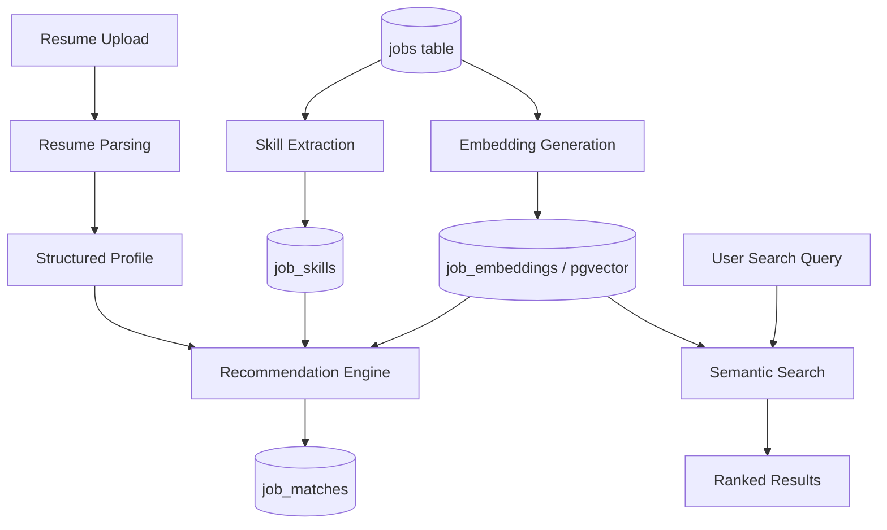

# 📓 BOOK 6 — AI Documentation

| Field | Value |
|---|---|
| Project Name | JobAtlas |
| Document Type | AI Features Specification |
| Version | 1.0 |
| Status | Draft |
| Depends On | Book 1 (Ch. 13), Book 2 (Ch. 9), Book 3 (Ch. 13), Book 4 (Ch. 19–20), Book 5 (Ch. 6, 13–14) |

---

## Table of Contents

1. Introduction & Scope
2. AI Architecture Overview
3. Model Selection & Provider Strategy
4. Resume Parsing
5. Skill Extraction (from Job Descriptions)
6. Embedding Generation & Storage
7. Vector Search / Semantic Search
8. Recommendation Engine (Resume-to-Job Matching)
9. Salary Prediction
10. Company Insights
11. Job Description Summarization
12. Prompt Engineering Standards
13. AI Workflows — Orchestration Detail
14. Cost & Latency Budget
15. Evaluation & Quality Assurance
16. Safety, Bias & Fairness
17. Data Privacy for AI Processing
18. Failure Modes & Fallbacks
19. Checklists & Acceptance Criteria

---

## Chapter 1 — Introduction & Scope

### 1.1 Purpose
This document specifies every AI-driven feature in JobAtlas: what it does, which model/technique powers it, its data contract with the schema in Book 2, and how it's orchestrated by the workflows in Book 4. It is the authoritative reference for the AI Engine defined at architecture level in Book 1, Chapter 13.

### 1.2 v1 vs Future Scope

| Feature | Status |
|---|---|
| Resume Parsing | v1 |
| Skill Extraction | v1 |
| Job Description Summarization | v1 |
| Resume-to-Job Matching (structured) | v1 |
| Embedding Generation & Storage | v1 (infrastructure), used lightly |
| Semantic Search | v1.1 (behind `mode=semantic`, Book 3 Ch. 8.1) |
| Salary Prediction | Stage 2 |
| Company Insights | Stage 2 |
| Interview Preparation | Stage 3 (Book 1 Ch. 2.2) |

---

## Chapter 2 — AI Architecture Overview



All AI components read from and write to the tables defined in Book 2, Chapter 9 (`resume_profiles`, `job_matches`, `job_embeddings`), and are invoked exclusively through the n8n orchestration shells defined in Book 4, Chapters 19–20 — no AI call happens synchronously inside the public request path of Book 3's API except where explicitly noted (Chapter 13.3).

---

## Chapter 3 — Model Selection & Provider Strategy

| Task | Model Type | Rationale |
|---|---|---|
| Resume parsing | General-purpose LLM (structured output / JSON mode) | Handles varied resume formats/layouts robustly |
| Skill extraction | Same LLM, lighter prompt | Reuse infra, avoid a second vendor integration for v1 |
| Embeddings | Dedicated embedding model (e.g., 1536-dim, matches Book 2 Ch. 9 `VECTOR(1536)`) | Purpose-built for similarity search, cheaper per-call than LLM |
| Summarization | Same general-purpose LLM | Consistency, shared prompt library |
| Salary prediction (Stage 2) | Statistical/ML model trained on internal salary data, not an LLM | Regression task with structured features is better served by a trained model than a generative one |

### 3.1 Provider Abstraction
All LLM/embedding calls go through a single internal `AIClient` interface (not a specific vendor SDK sprinkled through the codebase), so the underlying provider can be swapped without touching calling code in Book 4's workflows. Configuration (model name, API key) is environment-driven, following Book 1, Chapter 20's principle of deferred/reversible technology choices.

---

## Chapter 4 — Resume Parsing

### 4.1 Input
Raw resume file (PDF/DOCX, ≤5MB, per Book 3 Ch. 13.1) converted to plain text via a text-extraction step before reaching the model.

### 4.2 Output Contract
Maps directly to `resume_profiles` columns (Book 2, Ch. 9):
```json
{
  "parsedSkills": ["React", "Node.js", "PostgreSQL"],
  "parsedExperience": [
    { "title": "Software Engineer", "company": "Acme", "startDate": "2022-01", "endDate": "2024-06" }
  ],
  "parsedTitles": ["Software Engineer", "Backend Developer"]
}
```

### 4.3 Process (implements Book 4, Chapter 19)
1. Extract raw text from file.
2. Call LLM with the **Resume Parsing Prompt** (Chapter 12.1), requesting strict JSON output.
3. Validate JSON against the output contract schema (4.2); on validation failure, retry once with a corrective follow-up prompt ("your last response was invalid JSON, return only valid JSON matching this schema").
4. On repeated failure, mark `resume_profiles.status = 'failed'` (Book 4 Ch. 19.2) — no silent guessing.

---

## Chapter 5 — Skill Extraction (from Job Descriptions)

### 5.1 Purpose
Populate `job_skills` (Book 2, Ch. 4.2) so jobs can be filtered/matched by skill even when the source ATS doesn't provide structured skill tags.

### 5.2 Process
Runs as a lightweight step inside job processing (can be deferred/batched rather than synchronous per-job, to control cost — see Chapter 14) using the **Skill Extraction Prompt** (Chapter 12.2). Extracted skills are matched against the canonical `skills` table (Book 2, Ch. 6) via fuzzy matching; unmatched novel skills are queued for periodic human/admin review before being added to the canonical list, preventing skill-table sprawl from LLM hallucination or inconsistent naming.

### 5.3 Output
```json
{ "skills": [{ "name": "React", "confidence": 0.95 }, { "name": "GraphQL", "confidence": 0.72 }] }
```
`confidence` populates `job_skills.confidence` (Book 2, Ch. 4.2), allowing the Recommendation Engine (Chapter 8) to weight low-confidence tags less heavily.

---

## Chapter 6 — Embedding Generation & Storage

### 6.1 What Gets Embedded
Each active job's `title + description` (truncated to model context limits) is embedded into a single vector stored in `job_embeddings` (Book 2, Ch. 9).

### 6.2 Generation Triggers
- On job creation (`action: created`, Book 3 Ch. 15.1) — queued, not synchronous, to keep ingestion latency low (Book 1 Ch. 3 KPI: search response time, not embedding latency, is the hot-path target).
- Re-generated when `model_version` changes (model upgrade), via a backfill batch job.

### 6.3 Storage
`pgvector` extension (Book 2, Ch. 12), `VECTOR(1536)` column, indexed with an HNSW or IVFFlat index for approximate nearest-neighbor search:
```sql
CREATE INDEX idx_job_embeddings_ann ON job_embeddings
    USING hnsw (embedding vector_cosine_ops);
```

---

## Chapter 7 — Vector Search / Semantic Search

### 7.1 Query Flow (implements Book 3, Chapter 8.1 `mode=semantic`)
1. User query text → embedded via the same embedding model as Chapter 6.
2. Cosine-similarity search against `job_embeddings` (pgvector) OR, if Meilisearch's vector search feature is enabled (Book 1 Ch. 12.2 upgrade path), delegated there for consistency with keyword search infrastructure.
3. Combine with structured filters (location, salary, remote) applied as a pre-filter or post-filter depending on selectivity — pre-filter when a facet is highly selective (e.g., a specific country), post-filter over the top-K similarity results otherwise.
4. Return ranked results in the same envelope as keyword search (Book 3, Ch. 8.1).

### 7.2 Example Query
```
GET /search?q=remote%20react%20jobs%20in%20europe%20paying%20above%20%E2%82%AC70k&mode=semantic
```
The natural-language query is embedded as-is; explicit numeric/location constraints ("above €70k", "in Europe") are additionally extracted via a lightweight parsing step and applied as structured filters (Chapter 7.1, step 3), rather than relied upon purely via embedding similarity — this hybrid approach avoids the common failure mode of pure semantic search ignoring hard numeric constraints.

---

## Chapter 8 — Recommendation Engine (Resume-to-Job Matching)

### 8.1 v1 Approach: Structured Scoring
Rather than a single opaque embedding-similarity score, v1 combines multiple signals for interpretability and easier debugging:

```
matchScore = 0.5 × skill_overlap_score
           + 0.3 × title_similarity_score
           + 0.2 × embedding_cosine_similarity
```

- `skill_overlap_score`: Jaccard-style overlap between `resume_profiles.parsed_skills` and a job's `job_skills`.
- `title_similarity_score`: string/embedding similarity between `parsed_titles` and job `title`.
- `embedding_cosine_similarity`: resume-profile embedding (generated the same way as Chapter 6, applied to resume text) vs. job embedding.

### 8.2 Storage
Written to `job_matches` (Book 2, Ch. 9) as `match_score NUMERIC(5,4)`.

### 8.3 Orchestration
Implements Book 4, Chapter 20 — runs on resume-ready trigger (immediate) and nightly (to catch newly ingested jobs against existing resumes), scoped to active jobs in the user's likely-relevant categories to bound compute cost (Chapter 14).

### 8.4 Why Not Pure LLM Scoring
An LLM call per resume-job pair does not scale economically at 10M+ jobs (Book 1 Ch. 3 KPI). The structured formula (8.1) is computed cheaply for the full candidate pool; an LLM MAY be used only for a final re-rank of the top ~20 candidates per user, where cost is bounded and explanation quality matters more (e.g., generating a short "why this matches" blurb for the UI's `MatchScoreBadge`, Book 5 Ch. 6).

---

## Chapter 9 — Salary Prediction (Stage 2)

### 9.1 Purpose
Estimate a salary range for jobs that don't publish one (a large fraction of listings), to support Book 1's `salaryMin`/`salaryMax` filters (Book 3 Ch. 7.1) even on unlabeled postings.

### 9.2 Approach (deferred, specified for forward compatibility)
A regression model trained on JobAtlas's own historical data (title, location, company size, skills → observed salary where available), not a general-purpose LLM call. Predicted values are stored in separate `predicted_salary_min`/`predicted_salary_max` columns (a Book 2 schema addition when this stage is implemented) and always visually distinguished from employer-published salary in the UI (Book 5), to avoid misrepresenting estimates as fact.

---

## Chapter 10 — Company Insights (Stage 2)

### 10.1 Purpose
Aggregate signals (hiring velocity, common skills requested, salary bands observed) per company into a readable summary for the Company Profile page (Book 5, Ch. 10).

### 10.2 Approach
Primarily computed via SQL aggregation over `jobs`/`job_skills` (no AI required for the numeric parts); an LLM MAY be used only to turn the aggregated statistics into a short natural-language summary ("Acme Inc. has posted 45 engineering roles in the last 90 days, most commonly requiring React and PostgreSQL"), generated from the computed numbers, never inventing figures itself (Chapter 16 — Safety & Fairness).

---

## Chapter 11 — Job Description Summarization

### 11.1 Purpose
Short (2–3 sentence) summary for `JobCard` previews (Book 5, Ch. 6) where the full description would be too long.

### 11.2 Process
Generated at ingestion time (batched, not per-request) using the **Summarization Prompt** (Chapter 12.3), stored as an additional field on `jobs` (schema addition: `summary TEXT`) rather than computed live on every search request.

---

## Chapter 12 — Prompt Engineering Standards

### 12.1 Resume Parsing Prompt (template)
```
You are extracting structured data from a resume. Return ONLY valid JSON matching this schema:
{ "parsedSkills": string[], "parsedExperience": [{"title","company","startDate","endDate"}], "parsedTitles": string[] }

Rules:
- Do not infer skills that are not explicitly stated or clearly implied by listed technologies/tools.
- Dates in YYYY-MM format; use null if not determinable.
- If the document is not a resume, return { "error": "NOT_A_RESUME" }.

Resume text:
"""{{resumeText}}"""
```

### 12.2 Skill Extraction Prompt (template)
```
Extract technical and professional skills explicitly mentioned or clearly required in this job description.
Return ONLY JSON: { "skills": [{"name": string, "confidence": number 0-1}] }
Do not include soft skills unless central to the role (e.g., "public speaking" for a DevRel role).

Job description:
"""{{jobDescription}}"""
```

### 12.3 Summarization Prompt (template)
```
Summarize this job posting in 2-3 sentences for a job-search result card.
Focus on: role, key responsibilities, and standout requirements.
Do not include the company name (shown separately) or restate the job title verbatim.

Job description:
"""{{jobDescription}}"""
```

### 12.4 General Prompting Rules
1. Always request structured (JSON) output for anything consumed programmatically — never parse free text with regex.
2. Always include explicit "do not hallucinate / do not infer beyond the source text" instructions for extraction tasks (Chapter 16).
3. Version every prompt template (`v1`, `v2`, ...) and store the version alongside generated data (`resume_profiles`, `job_matches` could carry a `prompt_version` column) so quality regressions are traceable to a specific prompt change.
4. Keep prompts in a version-controlled prompt library (not inline strings scattered across n8n nodes), referenced by name/version from the workflows in Book 4.

---

## Chapter 13 — AI Workflows — Orchestration Detail

This chapter cross-references and extends Book 4, Chapters 19–20 with AI-specific detail not covered there.

### 13.1 Resume Processing (Book 4 Ch. 19) — AI-specific additions
- Text extraction library choice: a PDF/DOCX-to-text library run before the LLM call (not the LLM itself, to save cost and improve reliability).
- Prompt used: Chapter 12.1.
- On `NOT_A_RESUME` response (12.1's built-in guard) → `resume_profiles.status = 'failed'`, reason surfaced to the user (Book 5 Ch. 13.1).

### 13.2 AI Matching (Book 4 Ch. 20) — AI-specific additions
- Scoring formula: Chapter 8.1.
- Candidate pre-selection: restrict to jobs in categories overlapping `parsed_titles`' likely category, then compute the full formula only over that reduced set (cost control, Chapter 14).
- Optional LLM re-rank + explanation blurb for top 20 (Chapter 8.4) — a separate, explicitly-flagged sub-step so it can be disabled independently if cost/latency requires.

### 13.3 Semantic Search — synchronous exception
Unlike other AI features, semantic search (Chapter 7) runs **synchronously** in the request path of `GET /search?mode=semantic` (Book 3 Ch. 8.1), since it is directly user-facing and must meet the <300ms target (Book 1 Ch. 3) — this is achieved by embedding only the query (a single small, fast embedding call) and searching pre-computed job embeddings (Chapter 6), never embedding jobs on the fly.

---

## Chapter 14 — Cost & Latency Budget

| Operation | Frequency | Latency Budget | Cost Control |
|---|---|---|---|
| Resume parsing | Per upload | Async, target <30s | Low volume (user-initiated), acceptable per-call cost |
| Skill extraction | Per new job | Batched, async | Batch calls where the provider supports it; skip re-extraction on `lastSeen` refresh (only on `created`) |
| Embedding generation | Per new job | Async, queued | Cheaper embedding model; batch API calls |
| Query embedding (semantic search) | Per search request | Synchronous, <100ms | Small, fast embedding model reserved specifically for query-time use |
| Recommendation scoring | Per resume-ready + nightly | Async batch | Candidate pre-selection (13.2) bounds the pool before scoring |
| LLM re-rank/explanation | Top 20 per user, on-demand | Async, cached | Only computed when a user actually views recommendations; cached until next nightly refresh |

---

## Chapter 15 — Evaluation & Quality Assurance

1. **Resume parsing accuracy** — maintain a held-out labeled set of ~50 sample resumes; run automated comparison after any prompt/model change, tracking field-level precision/recall.
2. **Skill extraction precision** — periodic admin review sample (Chapter 5.2) doubles as a QA signal; track the rate of extracted skills rejected during review.
3. **Match quality** — track click-through and save rate on recommended jobs (`GET /recommendations`, Book 3 Ch. 13.3) as an implicit quality signal; feed into future formula-weight tuning (Chapter 8.1).
4. **Semantic search relevance** — track zero-result rate and query reformulation rate (user immediately re-searches) via `search_history` (Book 2, Ch. 11).

---

## Chapter 16 — Safety, Bias & Fairness

1. **No protected-class inference or use.** The system MUST NOT infer or use protected characteristics (age, gender, ethnicity, disability, etc.) in resume parsing, matching, or ranking — Chapter 4's output contract explicitly excludes such fields, and prompts (Chapter 12) never request them.
2. **Extraction, not judgment.** AI features extract and summarize factual content (skills, experience, job requirements); they do not make hire/no-hire style value judgments about candidates.
3. **Hallucination guardrails.** Every extraction prompt (Chapter 12) explicitly instructs against inferring facts not present in the source text; outputs feeding structured fields are validated against a schema before storage (Chapter 4.3).
4. **Transparency in the UI.** Predicted/estimated values (Salary Prediction, Chapter 9) are always visually distinguished from employer-published facts (Book 5).

---

## Chapter 17 — Data Privacy for AI Processing

(Extends Book 1, Chapter 32.4 and Book 2's retention rules)

1. Resume text sent to the LLM provider is not used to train third-party models where the provider offers a no-training/enterprise data-handling option — this MUST be a selection criterion in Chapter 3's provider strategy, not an afterthought.
2. Resume files and parsed profiles are deleted when a user deletes their account (Book 1 Ch. 30, Ch. 32.3), including any cached embeddings derived from resume text.
3. No resume content is logged in plaintext in `api_logs`/`workflow_logs` (Book 2, Ch. 10) — only metadata (resumeId, status, timing).

---

## Chapter 18 — Failure Modes & Fallbacks

| Failure | Fallback |
|---|---|
| LLM provider outage | Resume parsing/skill extraction queue and retry (Book 4 Ch. 4.2 pattern); search falls back to keyword-only (`mode=keyword`) automatically if `mode=semantic` embedding call fails |
| Embedding provider outage | Semantic search temporarily disabled (graceful degrade to keyword search), job embedding backfill queue accumulates and drains once restored |
| Malformed/unparseable resume | `status='failed'` with user-facing message (Book 4 Ch. 19.2), never a fabricated empty profile |
| Extraction produces invalid JSON | One corrective retry (Chapter 4.3), then fail explicitly |

---

## Chapter 19 — Checklists & Acceptance Criteria

### 19.1 Completeness Checklist
- [ ] Every AI feature listed in Book 1 Ch. 13 has a corresponding chapter here
- [ ] Every feature's output contract maps to a specific Book 2 column/table
- [ ] Every prompt is versioned and stored in a prompt library, not inline
- [ ] Every synchronous (request-path) AI call has an explicit latency budget (Ch. 14)

### 19.2 Acceptance Criteria for "Book 6 Complete"
- [ ] An engineer or AI coding agent can implement the `AIClient` interface and all n8n AI nodes (Book 4, Ch. 19–20) directly from this document
- [ ] Fairness/safety constraints (Ch. 16) are enforced in prompts, not left to model discretion
- [ ] Cost/latency budgets (Ch. 14) are consistent with Book 1's KPI targets (Ch. 3)

---

## Document Status & Next Steps

This completes **Book 6 — AI Documentation, v1.0**. It fully specifies the AI Engine architecturally defined in Book 1 (Ch. 13), implemented via the workflows in Book 4 (Ch. 19–20), exposed through Book 3's API (Ch. 13), and surfaced in Book 5's UI (Ch. 6, 13–14).

**Feeds directly into:**
- **Book 7 — Deployment & Scaling**, which will define how AI provider credentials are managed, how embedding/queue infrastructure is deployed, and cost-monitoring dashboards.

**Status: ✅ Book 6 Complete — Ready to proceed to Book 7 (Deployment & Scaling).**
