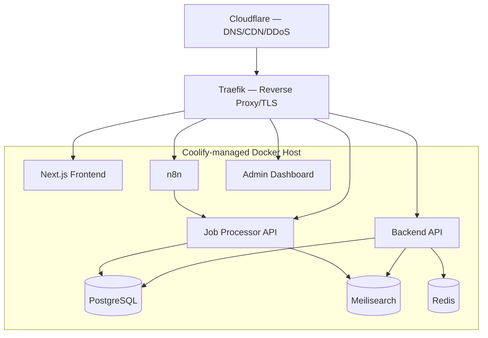

# 📔 BOOK 7 — Deployment & Scaling

| Field | Value |
|---|---|
| Project Name | JobAtlas |
| Document Type | Deployment & Scaling Plan |
| Version | 1.0 |
| Status | Draft |
| Depends On | All prior books (this is the implementation-infrastructure layer for Books 1–6) |

---

## Table of Contents

1. Introduction & Deployment Philosophy
2. Infrastructure Overview
3. Docker & Container Strategy
4. Coolify — Orchestration Layer
5. Traefik — Reverse Proxy & TLS
6. PostgreSQL Deployment
7. Redis Deployment
8. Meilisearch Deployment
9. n8n Deployment
10. Frontend Deployment
11. Backend & Job Processor API Deployment
12. AI Provider & Secrets Configuration
13. Environments (Dev / Staging / Production)
14. Monitoring & Alerting
15. Logging Infrastructure
16. Backup & Disaster Recovery Execution
17. Scaling Playbook
18. Load Balancing
19. CDN & Static Asset Delivery
20. SSL / Cloudflare Configuration
21. CI/CD Pipeline
22. Cost Estimate by Phase
23. Production Readiness Checklist
24. Runbooks

---

## Chapter 1 — Introduction & Deployment Philosophy

### 1.1 Purpose
This document specifies how every component defined in Books 1–6 is containerized, deployed, monitored, scaled, and recovered. It is the final implementation layer — where architecture (Book 1) becomes running infrastructure.

### 1.2 Philosophy
Consistent with Book 1, Chapter 20 and Chapter 31: **self-hosted, cost-predictable infrastructure during the pre-revenue phase**, with clearly defined, measurable triggers for adopting heavier infrastructure (Kubernetes, managed clusters, multi-region) rather than adopting it prematurely.

---

## Chapter 2 — Infrastructure Overview



All application containers run on a Coolify-managed Docker host (Chapter 4). External traffic enters via Cloudflare (Chapter 20) and Traefik (Chapter 5) before reaching any service.

---

## Chapter 3 — Docker & Container Strategy

### 3.1 Principles
1. One container per service (Frontend, Backend API, Job Processor API, n8n, PostgreSQL, Meilisearch, Redis) — mirrors the modular service boundaries from Book 1, Chapter 14.
2. Multi-stage builds for all Node.js services (Frontend, Backend API, Job Processor API) to keep production images minimal.
3. No secrets baked into images — all configuration via environment variables injected at runtime (Chapter 12).
4. Health checks defined on every container (`HEALTHCHECK` directive or Coolify-native equivalent) feeding Chapter 14's monitoring.

### 3.2 docker-compose.yml (illustrative, Phase 1)
```yaml
version: "3.9"
services:
  frontend:
    build: ./frontend
    environment:
      - NEXT_PUBLIC_API_URL=https://api.jobatlas.io/api/v1
    depends_on: [backend-api]

  backend-api:
    build: ./backend
    environment:
      - DATABASE_URL=${DATABASE_URL}
      - REDIS_URL=${REDIS_URL}
      - MEILISEARCH_URL=${MEILISEARCH_URL}
      - JWT_SECRET=${JWT_SECRET}
    depends_on: [postgres, redis, meilisearch]

  job-processor-api:
    build: ./job-processor
    environment:
      - DATABASE_URL=${DATABASE_URL}
      - MEILISEARCH_URL=${MEILISEARCH_URL}
      - SERVICE_KEY=${INTERNAL_SERVICE_KEY}
    depends_on: [postgres, meilisearch]

  n8n:
    image: n8nio/n8n:latest
    environment:
      - N8N_ENCRYPTION_KEY=${N8N_ENCRYPTION_KEY}
      - DB_TYPE=postgresdb
      - DB_POSTGRESDB_HOST=postgres
    volumes:
      - n8n_data:/home/node/.n8n
    depends_on: [postgres]

  postgres:
    image: postgres:15
    environment:
      - POSTGRES_DB=jobatlas
      - POSTGRES_PASSWORD=${POSTGRES_PASSWORD}
    volumes:
      - pg_data:/var/lib/postgresql/data

  redis:
    image: redis:7-alpine
    volumes:
      - redis_data:/data

  meilisearch:
    image: getmeili/meilisearch:v1.8
    environment:
      - MEILI_MASTER_KEY=${MEILI_MASTER_KEY}
    volumes:
      - meili_data:/meili_data

volumes:
  pg_data:
  redis_data:
  meili_data:
  n8n_data:
```

---

## Chapter 4 — Coolify: Orchestration Layer

### 4.1 Role
Coolify manages the Docker host: deployments, environment variable injection, automatic Traefik configuration, container restarts, and basic resource monitoring — chosen (Book 1, Ch. 20) to avoid Kubernetes overhead while still getting PaaS-like deploy ergonomics on self-hosted infrastructure.

### 4.2 Setup Notes
- Each service in Chapter 3.2 is registered as a Coolify "resource" with its own deploy trigger (Git push → auto-deploy for Frontend/Backend/JPA; manual/scheduled for infra services like n8n/Postgres).
- Environment variables per Chapter 12 are managed in Coolify's secret store, never committed to the repository (Book 1, Ch. 16 — Security).
- Coolify's built-in health-check UI feeds into the alerting described in Chapter 14, supplementing (not replacing) the application-level Health Check workflow (Book 4, Ch. 15).

---

## Chapter 5 — Traefik: Reverse Proxy & TLS

### 5.1 Responsibilities
- Route incoming requests by hostname/path to the correct container.
- Terminate TLS (automatic Let's Encrypt certificate issuance/renewal).
- Enforce HTTPS-only (Book 1, Ch. 16) via automatic HTTP→HTTPS redirect.

### 5.2 Routing Table

| Hostname | Routes To |
|---|---|
| `jobatlas.io` | Frontend |
| `api.jobatlas.io` | Backend API |
| `internal.jobatlas.io` | Job Processor API (restricted, Chapter 5.3) |
| `n8n.jobatlas.io` | n8n editor UI (admin-only access) |
| `admin.jobatlas.io` | Admin Dashboard (or served as a route within Frontend) |

### 5.3 Internal API Network Isolation
`internal.jobatlas.io` (Job Processor API, Book 3 Ch. 15) is configured in Traefik with an IP allowlist middleware restricting access to the Docker internal network / n8n's container only — it is not intended to be internet-reachable at all in the target state; the subdomain exists for operational debugging access via VPN, not public routing.

---

## Chapter 6 — PostgreSQL Deployment

### 6.1 Phase 1
Single PostgreSQL 15 container, persistent volume, daily automated `pg_dump` (Book 2, Ch. 17) via a scheduled Coolify job or cron container.

### 6.2 Phase 2 (triggered by Book 1 Ch. 18 scaling triggers)
- Read replica(s) added for search-adjacent/analytics read traffic (Book 2, Ch. 15.2).
- Connection pooling via PgBouncer placed in front of PostgreSQL once concurrent connections from multiple API instances approach PostgreSQL's `max_connections`.

### 6.3 Configuration Highlights
```
shared_buffers = 25% of container RAM
effective_cache_size = 60-70% of container RAM
autovacuum_vacuum_scale_factor = 0.05   -- for jobs, job_updates (Book 2 Ch.15.3)
max_connections = 200                    -- lowered once PgBouncer is introduced
```

---

## Chapter 7 — Redis Deployment

### 7.1 v1 Uses
- Rate limiting counters (Book 3, Ch. 4).
- API response caching for high-traffic, low-personalization endpoints (`GET /filters`, `GET /categories`, Book 3 Ch. 10).
- Session/refresh-token denylist for revoked sessions (Book 2, Ch. 7).

### 7.2 Phase 3 Use
Backbone for the event bus described in Book 1, Chapter 25.2 (Redis Streams), when ingestion volume requires decoupling the Job Processor API from downstream consumers.

### 7.3 Configuration
Single instance, AOF persistence enabled (durability for rate-limit/session data survives restarts), no clustering required until Phase 3.

---

## Chapter 8 — Meilisearch Deployment

### 8.1 v1
Single instance, persistent volume, master key stored as a Coolify secret. Index rebuilt from PostgreSQL (Book 2, Ch. 12.3) via a one-off admin-triggered job whenever a full reconciliation is needed.

### 8.2 Resource Sizing
Meilisearch is memory-bound relative to index size; provision RAM to comfortably exceed the on-disk index size as job volume grows toward the Book 1 Ch. 3 KPI (5–10M jobs).

### 8.3 Migration Trigger to OpenSearch
Per Book 1, Chapter 12.2/20: migrate when (a) index size approaches available host memory limits even after vertical scaling, or (b) vector search at full job-corpus scale (Book 6, Ch. 6–7) exceeds Meilisearch's practical vector-search capacity. This is a planned, documented cutover — not a reactive emergency migration — and should be piloted in staging before production cutover.

---

## Chapter 9 — n8n Deployment

### 9.1 v1
Single n8n instance (Book 1, Ch. 18 Phase 1), PostgreSQL-backed (shares the same PostgreSQL server in v1, using a dedicated `n8n` database/schema — logically separate from the `jobatlas` application schema to avoid coupling migrations).

### 9.2 Scaling (Phase 2, Book 1 Ch. 18)
n8n supports a **queue mode** (separate main/worker processes backed by Redis) — adopted when a single instance can no longer execute all collector workflows (Book 4) within their scheduled cadence windows. This directly implements Book 1 Chapter 18 Phase 2's "multiple ingestion workers."

### 9.3 Access Control
The n8n editor UI (`n8n.jobatlas.io`) is restricted to admin users only, via Traefik basic-auth middleware layered on top of n8n's own authentication, consistent with Book 1's RBAC principle (Ch. 16) applied at the infrastructure level.

---

## Chapter 10 — Frontend Deployment

Next.js app built via multi-stage Docker build (Chapter 3.1), served in SSR mode (not static export, since Book 5 requires SSR for SEO-critical pages, Ch. 20). Static assets (`_next/static`) served via CDN (Chapter 19) rather than directly from the container.

---

## Chapter 11 — Backend & Job Processor API Deployment

Both are stateless Node.js services (Book 1, Ch. 14) and can be horizontally scaled by simply increasing container replica count behind Traefik once CPU/latency metrics (Chapter 14) justify it — no code changes required, since all state lives in PostgreSQL/Redis, never in-process (Book 1, Ch. 15.2 statelessness principle applied server-side too).

---

## Chapter 12 — AI Provider & Secrets Configuration

Extends Book 6, Chapter 3 (Provider Abstraction) at the infrastructure level:

| Secret | Stored In | Used By |
|---|---|---|
| `AI_PROVIDER_API_KEY` | Coolify secret store | Backend API, n8n AI nodes (Book 4 Ch. 19–20) |
| `EMBEDDING_PROVIDER_API_KEY` | Coolify secret store | Job Processor API (embedding generation, Book 6 Ch. 6) |
| `INTERNAL_SERVICE_KEY` | Coolify secret store | n8n → Job Processor API auth (Book 3 Ch. 2.4) |
| `JWT_SECRET` | Coolify secret store | Backend API (Book 3 Ch. 2) |
| `MEILI_MASTER_KEY` | Coolify secret store | Backend API, Job Processor API |
| `N8N_ENCRYPTION_KEY` | Coolify secret store | n8n (encrypts stored credentials, Book 4 Ch. 21) |

All secrets rotated per Book 4, Chapter 21's quarterly rotation policy; rotation procedure documented in Chapter 24 (Runbooks).

---

## Chapter 13 — Environments

| Environment | Purpose | Data |
|---|---|---|
| Development | Local Docker Compose, engineer laptops | Seed/fixture data only |
| Staging | Mirrors production topology at smaller scale | Sanitized subset of production data or synthetic data; no real user PII |
| Production | Live system | Real data, full backup/monitoring coverage |

Staging is mandatory for: search-engine migrations (Ch. 8.3), n8n queue-mode cutover (Ch. 9.2), and any schema migration touching the `jobs` table (Book 2, Ch. 18).

---

## Chapter 14 — Monitoring & Alerting

Implements Book 1, Chapter 17.

### 14.1 Signals & Thresholds

| Signal | Source | Alert Threshold |
|---|---|---|
| API p95 latency | Backend API metrics | >300ms sustained 5min (Book 1 Ch. 3 KPI) |
| API error rate | `api_logs` (Book 2 Ch. 10.3) | >1% over 5min |
| Source sync success rate | `sync_logs` (Book 2 Ch. 10.2) | <90% over 7 days (Book 4 Ch. 15) |
| PostgreSQL connection saturation | DB metrics | >80% of `max_connections` |
| Meilisearch indexing lag | Index vs. DB row count delta | >5 min lag |
| Disk usage (any volume) | Host metrics | >80% |
| Failed ingestion rate | `workflow_logs` | >1% (Book 1 Ch. 3 KPI) |

### 14.2 Alerting Channel
All threshold breaches route to the same admin notification channel used by Book 4's Health Check workflow (Ch. 15) — a single alerting surface, not fragmented per-tool notifications.

---

## Chapter 15 — Logging Infrastructure

Implements Book 1, Chapter 27 format standards.

- All container stdout/stderr collected centrally (e.g., via a lightweight log shipper into a self-hosted log store, or Coolify's built-in log aggregation for v1 simplicity).
- Structured JSON logs (Book 1 Ch. 27.1) are queryable by `requestId`, enabling end-to-end tracing of a single request across Frontend → Backend API → PostgreSQL/Meilisearch.
- Retention matches Book 1 Ch. 27.3 (30 days hot, 90 days cold) and Book 2's partitioning scheme (Ch. 14) for database-resident logs.

---

## Chapter 16 — Backup & Disaster Recovery Execution

Executes the plan defined in Book 1, Chapter 33 and Book 2, Chapter 17.

### 16.1 Backup Jobs
```
02:00 UTC daily — pg_dump full backup → off-site object storage
Continuous       — WAL archiving → off-site object storage
Monthly, 1st     — automated restore test into scratch environment
```

### 16.2 Recovery Runbook Summary (full detail in Chapter 24)
1. Provision/identify target host.
2. Restore latest `pg_dump` + replay WAL to desired point-in-time.
3. Redeploy application containers pointing at restored database.
4. Trigger full Meilisearch reindex from restored PostgreSQL (Book 1 Ch. 12.3 — index is always rebuildable).
5. Validate against the health checks in Chapter 14 before restoring public traffic.

---

## Chapter 17 — Scaling Playbook

Concretizes Book 1, Chapter 18 with measurable triggers:

| Trigger | Action |
|---|---|
| API p95 latency exceeds target sustained >1 week | Add Backend API/Job Processor API replicas behind Traefik (Ch. 11) |
| PostgreSQL connection saturation recurring | Introduce PgBouncer (Ch. 6.2) |
| Read-heavy admin/analytics queries impacting write latency | Add PostgreSQL read replica (Ch. 6.2) |
| Meilisearch memory/index-size approaching host limits | Begin OpenSearch migration (Ch. 8.3) |
| n8n unable to complete all scheduled runs within cadence window | Switch n8n to queue mode with workers (Ch. 9.2) |
| Ingestion volume requires decoupling processing from delivery | Introduce Redis Streams event bus (Book 1 Ch. 25.2) |
| Single-region latency complaints from a new user geography | Evaluate multi-region deployment (Book 1 Ch. 18 Phase 3) |

---

## Chapter 18 — Load Balancing

Traefik itself performs load balancing across replica containers of Backend API / Job Processor API / Frontend once they're scaled horizontally (Chapter 17), using round-robin by default with health-check-aware routing (unhealthy replicas automatically removed from rotation, feeding back into Chapter 14's monitoring).

---

## Chapter 19 — CDN & Static Asset Delivery

Cloudflare (Chapter 20) serves as CDN for: Next.js static assets (`_next/static`), company logos, and other public images. Cache-Control headers set aggressively (immutable, long max-age) for hashed static assets; short/no-cache for SSR HTML responses to keep job listings fresh.

---

## Chapter 20 — SSL / Cloudflare Configuration

### 20.1 DNS & Proxying
All public hostnames (Chapter 5.2) proxied through Cloudflare for DDoS protection and CDN benefits, with Cloudflare's SSL mode set to **Full (Strict)** — Cloudflare-to-origin traffic is also encrypted, terminating at Traefik's Let's Encrypt certificate (Chapter 5.1), not decrypted in plaintext at any hop.

### 20.2 Cloudflare-Level Protections
- Rate limiting rules as a first line of defense, complementing (not replacing) the application-level rate limiting in Book 3, Chapter 4.
- Bot-fight mode / WAF rules tuned to avoid blocking the legitimate collector traffic *JobAtlas itself sends outbound* to sources (this is outbound, unaffected by inbound WAF) while protecting inbound public endpoints.

---

## Chapter 21 — CI/CD Pipeline

### 21.1 Pipeline Stages (per service)
```
1. Lint + type-check
2. Unit tests
3. Build Docker image
4. Contract test (Backend API against Book 3's OpenAPI spec, Book 3 Ch.19)
5. Push image to registry
6. Deploy to Staging (auto)
7. Smoke test against Staging
8. Deploy to Production (manual approval gate)
```

### 21.2 Branching & Deployment Policy
Trunk-based development (Book 1, Ch. 28.3) with short-lived feature branches; merges to `main` auto-deploy to Staging; Production deploys require explicit approval, consistent with the manual-approval gate above.

### 21.3 Database Migrations in CI/CD
Migrations (Book 2, Ch. 18) run as a distinct pipeline step before application deployment, never bundled inside application container startup, so a failed migration halts deployment cleanly rather than starting an application against an inconsistent schema.

---

## Chapter 22 — Cost Estimate by Phase

| Phase | Infrastructure | Rough Monthly Cost Driver |
|---|---|---|
| Phase 1 (Foundation) | Single host, all services co-located | 1 VPS sized for Postgres+Meilisearch+n8n+apps |
| Phase 2 (Expansion) | Read replica, PgBouncer, multiple ingestion workers | +1-2 VPS, larger Meilisearch allocation |
| Phase 3 (Intelligence/Scale) | OpenSearch cluster, event bus, more API replicas | Meaningful step-up; revisit self-hosted vs. managed trade-off (Book 1 Ch. 31) at this point |
| Phase 4 (Scale) | Multi-region, distributed crawlers | Enterprise-level infra spend; requires revenue to justify |

Exact figures depend on the chosen hosting provider and are intentionally left as planning ranges rather than fixed numbers, per Book 1 Chapter 31's cost-optimization principle of deferring heavier spend until measurable triggers (Chapter 17) are hit.

---

## Chapter 23 — Production Readiness Checklist

- [ ] All secrets (Chapter 12) stored in Coolify secret store, none in source control
- [ ] TLS enforced end-to-end (Chapter 20.1, Full Strict mode)
- [ ] Daily backups running and monthly restore test passing (Chapter 16)
- [ ] Monitoring thresholds (Chapter 14.1) configured and alert channel verified
- [ ] Rate limiting active at both Cloudflare (Ch. 20.2) and application layer (Book 3 Ch. 4)
- [ ] Health Check workflow (Book 4 Ch. 15) running and correctly detecting a simulated source outage
- [ ] n8n editor UI access-restricted to admins (Chapter 9.3)
- [ ] Internal API (Job Processor API) not publicly reachable (Chapter 5.3)
- [ ] CI/CD pipeline includes contract testing against Book 3's API spec (Chapter 21.1)
- [ ] Staging environment validated for the most recent schema migration before production rollout
- [ ] Legal/compliance review completed for source connectors in production use (Book 1, Ch. 32)

---

## Chapter 24 — Runbooks

### 24.1 Runbook: PostgreSQL Restore
1. Identify target restore point (latest backup or specific WAL timestamp).
2. Spin up a scratch PostgreSQL instance.
3. Restore `pg_dump` + replay WAL to target point.
4. Run integrity checks: row counts on `jobs`, `users`; spot-check foreign keys.
5. Point a staging deployment at the restored database and run smoke tests.
6. Cut production over (update `DATABASE_URL` secret, redeploy dependent services).
7. Trigger full Meilisearch reindex.
8. Confirm health checks (Chapter 14) green before announcing recovery complete.

### 24.2 Runbook: Source Connector Emergency Disable
1. Admin identifies a misbehaving source via Health Check alert (Book 4 Ch. 15) or Admin Dashboard (Book 5 Ch. 16.1).
2. `PATCH /admin/sources/{id}` (Book 3 Ch. 14.3) with `isActive: false`.
3. Disable/pause the corresponding n8n workflow directly as a secondary safeguard.
4. Investigate root cause (source API/schema change) before re-enabling.

### 24.3 Runbook: Secret Rotation
1. Generate new secret value.
2. Add as a new Coolify secret version (do not delete old value yet).
3. Redeploy affected services referencing the new value.
4. Confirm affected services healthy (Chapter 14).
5. Revoke the old secret value at the provider/consumer side.

---

## Document Status & Next Steps

This completes **Book 7 — Deployment & Scaling, v1.0** — the final book in the JobAtlas documentation series.

## 📂 Complete Documentation Set

| Book | Status |
|---|---|
| 1 — System Architecture Document | ✅ Complete |
| 2 — Database Design Document | ✅ Complete |
| 3 — API Specification | ✅ Complete |
| 4 — n8n Workflow Documentation | ✅ Complete |
| 5 — Frontend Documentation | ✅ Complete |
| 6 — AI Documentation | ✅ Complete |
| 7 — Deployment & Scaling | ✅ Complete |

**The JobAtlas documentation set (Books 1–7) is now complete** and forms a single, cross-referenced source of truth — from business vision (Book 1) down to runbooks (Book 7) — suitable for handing to a human engineering team or an AI coding agent to begin implementation.

**Status: ✅ All 7 Books Complete.**
